# MI PRIMER LIBRO CodeIgniter 🚀

Bienvenido a este repositorio dedicado a recolectar diversos ejercicios para aprender a usar el framework CodeIgniter. Este repositorio está diseñado para ayudar a desarrolladores de todos los niveles a mejorar sus habilidades en CodeIgniter a través de ejemplos prácticos y ejercicios.

## Tabla de Contenidos 📑

- [MI PRIMER LIBRO CodeIgniter 🚀](#mi-primer-libro-codeigniter-)
  - [Tabla de Contenidos 📑](#tabla-de-contenidos-)
  - [Descripción 📝](#descripción-)
  - [Requisitos 🛠️](#requisitos-️)
  - [Instalación 📥](#instalación-)
  - [Referencias 🔗](#referencias-)
  - [Copiar código](#copiar-código)
- [CodeIgniter](#codeigniter)
- [Herramientas Necesarias para Programar en CodeIgniter](#herramientas-necesarias-para-programar-en-codeigniter)
  - [Pasos Básicos para Configurar tu Entorno](#pasos-básicos-para-configurar-tu-entorno)
- [Extensiones Útiles para Programar con CodeIgniter](#extensiones-útiles-para-programar-con-codeigniter)
  - [Visual Studio Code](#visual-studio-code)
- [Instalación Manual de CodeIgniter desde el Repositorio](#instalación-manual-de-codeigniter-desde-el-repositorio)
  - [1. Requisitos Previos](#1-requisitos-previos)
  - [2. Clonar el Repositorio de CodeIgniter](#2-clonar-el-repositorio-de-codeigniter)
- [Estructura de Carpetas de CodeIgniter](#estructura-de-carpetas-de-codeigniter)
- [Archivo .env en CodeIgniter](#archivo-env-en-codeigniter)
  - [Activación del Archivo .env](#activación-del-archivo-env)
  - [Contenido del Archivo .env](#contenido-del-archivo-env)
- [Herramienta de Línea de Comandos de CodeIgniter spark](#herramienta-de-línea-de-comandos-de-codeigniter-spark)
- [Configuración inicial](#configuración-inicial)
  - [Configuración Inicial del Archivo app.php](#configuración-inicial-del-archivo-appphp)
  - [Configuración del Archivo Database.php](#configuración-del-archivo-databasephp)
- [Configuración del modo de desarrollo](#configuración-del-modo-de-desarrollo)
- [Patrón MVC (Modelo-Vista-Controlador) 🌟](#patrón-mvc-modelo-vista-controlador-)
  - [¿Qué es MVC? 🤔](#qué-es-mvc-)
    - [Componentes de MVC 🧩](#componentes-de-mvc-)
    - [Flujo de Trabajo en MVC 🚦](#flujo-de-trabajo-en-mvc-)
    - [Descripción del Flujo 🔄](#descripción-del-flujo-)
    - [Diagrama detallado](#diagrama-detallado)
    - [Ventajas del MVC 🌟](#ventajas-del-mvc-)
    - [Desventajas del MVC 😕](#desventajas-del-mvc-)
    - [Ejemplos de Uso 🌐](#ejemplos-de-uso-)
- [Controllers](#controllers)
  - [Creación de un Controlador](#creación-de-un-controlador)
  - [Funciones de un Controlador](#funciones-de-un-controlador)
  - [Cargar Vistas en el Controlador](#cargar-vistas-en-el-controlador)
  - [Pasar Datos a la Vista](#pasar-datos-a-la-vista)
  - [Cargar Modelos en el Controlador](#cargar-modelos-en-el-controlador)
  - [Redireccionar en un Controlador](#redireccionar-en-un-controlador)
  - [Controladores RESTful](#controladores-restful)
  - [Seguridad en los Controladores](#seguridad-en-los-controladores)
  - [Ejemplo de un Controlador](#ejemplo-de-un-controlador)
- [Explicación de la Clase BaseController](#explicación-de-la-clase-basecontroller)
- [Enrutamiento en CodeIgniter 4](#enrutamiento-en-codeigniter-4)
  - [Definición de rutas](#definición-de-rutas)
    - [Secciones de una Ruta en CodeIgniter 4](#secciones-de-una-ruta-en-codeigniter-4)
  - [Tipos de enrutamientos](#tipos-de-enrutamientos)
    - [Enrutamiento Automático](#enrutamiento-automático)
    - [Enrutamiento Manual](#enrutamiento-manual)
    - [¿Cuándo Usar Cada Tipo?](#cuándo-usar-cada-tipo)
    - [Métodos Relacionados con el Enrutamiento Automático en CodeIgniter](#métodos-relacionados-con-el-enrutamiento-automático-en-codeigniter)
- [Vistas](#vistas)
  - [Introducción a las Vistas en CodeIgniter 4](#introducción-a-las-vistas-en-codeigniter-4)
- [Mandar información del controlador a la vista](#mandar-información-del-controlador-a-la-vista)
- [Retornar mas de una vista](#retornar-mas-de-una-vista)
- [Layouts](#layouts)
  - [Implementación de un Layout en CodeIgniter](#implementación-de-un-layout-en-codeigniter)
  - [1. Creación del Layout Principal](#1-creación-del-layout-principal)
  - [2. Uso del Layout en un Controlador](#2-uso-del-layout-en-un-controlador)
  - [3. Creación de Vistas Específicas](#3-creación-de-vistas-específicas)
  - [Ejemplo de Layout](#ejemplo-de-layout)
  - [Llamar una vista desde el layout](#llamar-una-vista-desde-el-layout)
- [Conexión a Base de Datos](#conexión-a-base-de-datos)
- [Modelos en CodeIgniter 4](#modelos-en-codeigniter-4)
  - [¿Qué son los Modelos en CodeIgniter 4? 🛠️](#qué-son-los-modelos-en-codeigniter-4-️)
  - [¿Para qué se usan los Modelos? 🎯](#para-qué-se-usan-los-modelos-)
  - [Cómo Usar los Modelos en CodeIgniter 4 📝](#cómo-usar-los-modelos-en-codeigniter-4-)
    - [Crear un Modelo](#crear-un-modelo)
  - [Usar un Modelo](#usar-un-modelo)
  - [Métodos Comunes de los Modelos 📚](#métodos-comunes-de-los-modelos-)
  - [Ejemplos de Uso 🧩](#ejemplos-de-uso--1)
  - [Configuración Adicional 🛠️](#configuración-adicional-️)
    - [Validación de Datos](#validación-de-datos)
    - [Callbacks](#callbacks)
  - [Propiedades de la tabla a consultar](#propiedades-de-la-tabla-a-consultar)
    - [ejemplo de un modelo](#ejemplo-de-un-modelo)
  - [Funciones de modelos](#funciones-de-modelos)
- [Constructor del controlador- instancia al modelo](#constructor-del-controlador--instancia-al-modelo)
- [Función findAll();](#función-findall)
  - [¿Qué es findAll()?](#qué-es-findall)
- [Función find()](#función-find)
  - [¿Qué hace la función find()?](#qué-hace-la-función-find)
- [FUNCIÓN insert() Y getInsertId()](#función-insert-y-getinsertid)
  - [Lamar al ultimo ID insertado](#lamar-al-ultimo-id-insertado)
- [FUNCION Update()](#funcion-update)
- [FUNCION Delete()](#funcion-delete)
- [FUNCION purgeDeleted()](#funcion-purgedeleted)
- [Query Builder Class en CodeIgniter 4](#query-builder-class-en-codeigniter-4)
  - [Características de la Query Builder Class](#características-de-la-query-builder-class)
  - [Ejemplos Prácticos](#ejemplos-prácticos)
  - [SELECT](#select)
  - [INSERT](#insert)
  - [UPDATE](#update)
  - [DELETE](#delete)
  - [Ventajas](#ventajas)
  - [Funcion where de la clase query builder](#funcion-where-de-la-clase-query-builder)
    - [Ver ultima query](#ver-ultima-query)
  - [Función select de la clase query builder](#función-select-de-la-clase-query-builder)
  - [Funcion orderBy() de la clase Query Builder](#funcion-orderby-de-la-clase-query-builder)
  - [Función limit(); de Query Builder](#función-limit-de-query-builder)
  - [Query Builder y sus demas funciones](#query-builder-y-sus-demas-funciones)
  - [Join conQuery Builder](#join-conquery-builder)
- [Migrations o Migraciones](#migrations-o-migraciones)
  - [Que son las migraciones](#que-son-las-migraciones)
  - [Cómo ejecutar una Migración](#cómo-ejecutar-una-migración)
  - [Migracion para crear una tabla y borrarla](#migracion-para-crear-una-tabla-y-borrarla)
  - [Migración para Modificar la Tabla (Agregar una Columna y eliminar)](#migración-para-modificar-la-tabla-agregar-una-columna-y-eliminar)
  - [Regresar a otra migración](#regresar-a-otra-migración)
  - [Ejecutar una migracion desde consola](#ejecutar-una-migracion-desde-consola)
- [Seeders](#seeders)
  - [Donde estan los seeders](#donde-estan-los-seeders)
  - [crear seeders desde CLI](#crear-seeders-desde-cli)
  - [Estructura de un seeder](#estructura-de-un-seeder)
  - [Ejecutar seeder con CLI y desde un controller](#ejecutar-seeder-con-cli-y-desde-un-controller)
- [Helpers](#helpers)
  - [ubicacion](#ubicacion)
  - [Como Activar un helper](#como-activar-un-helper)
  - [Creacion de Helper](#creacion-de-helper)
- [Creacion de formularios](#creacion-de-formularios)
- [Validaciones con Helper validations](#validaciones-con-helper-validations)
  - [Evita que se reiniciew el formulario despues de validar](#evita-que-se-reiniciew-el-formulario-despues-de-validar)
  - [Error alado del input](#error-alado-del-input)
- [Validaciones personalizadas](#validaciones-personalizadas)
- [Uso de CLI SPARK](#uso-de-cli-spark)
- [Metodos HTTP y RESTfull](#metodos-http-y-restfull)
- [SUBIR ARCHIVO](#subir-archivo)

## Descripción 📝

Este repositorio contiene una serie de ejercicios diseñados para enseñar los conceptos básicos y avanzados del framework CodeIgniter. Los ejercicios están organizados de manera progresiva para que puedas seguir aprendiendo paso a paso.

## Requisitos 🛠️

- PHP 8.2 o superior
- Servidor web (Apache, Nginx, etc.)
- Composer
- MySQL o cualquier otro sistema de base de datos compatible con CodeIgniter

## Instalación 📥

1. Clona este repositorio en tu máquina local:

   ```bash
   git clone https://github.com/LechugasJorge/codeIgniter.git
   ```

2. Navega al directorio del proyecto:

## Referencias 🔗

Este repositorio se basa en el siguiente curso de YouTube:

Curso de CodeIgniter - Introducción por Juan de la Torre
Contribuciones 🤝
¡Las contribuciones son bienvenidas! Si deseas contribuir, por favor sigue estos pasos:

Haz un fork del repositorio.
Crea una rama con una descripción clara de tu mejora:
bash
Copiar código
git checkout -b mejora-descripción
Realiza tus cambios y haz commits con mensajes descriptivos.
Envía un pull request detallando los cambios realizados.
Licencia 📄
Este proyecto está licenciado bajo la Licencia MIT. Consulta el archivo LICENSE para obtener más detalles.

## Copiar código

¡Listo para usar! 🚀👨‍💻 Si necesitas algo más, aquí estoy. 😊

# CodeIgniter

CodeIgniter es un framework web PHP full-stack que es ligero, rápido, flexible y seguro.

Es un marco de desarrollo de aplicaciones, un conjunto de herramientas, para personas que construyen sitios web usando PHP. Su objetivo es permitirle Desarrolla proyectos mucho más rápido de lo que podrías hacerlo si estuvieras escribiendo código desde cero, proporcionando un amplio conjunto de bibliotecas para las tareas, así como una interfaz sencilla y una estructura lógica para acceder a estas bibliotecas.

CodeIgniter te permite centrarte creativamente en tu proyecto minimizando la cantidad de código necesario para una tarea determinada.

En la medida de lo posible, CodeIgniter se ha mantenido lo más flexible posible, permitiéndote trabajar de la manera que quieras, sin que te obliguen a trabajar de cierta manera. El marco puede tener partes centrales fácilmente extendidas o se reemplaza por completo para que el sistema funcione de la manera que necesita.

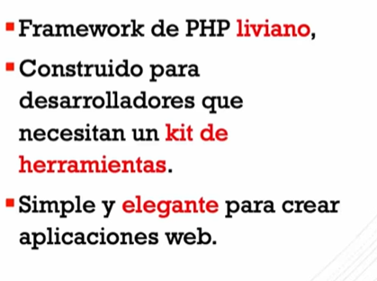

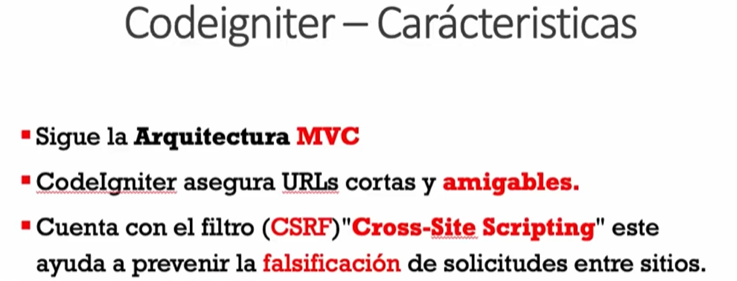

CodeIgniter es un framework de desarrollo web para PHP. 🚀 Está diseñado para desarrolladores que necesitan un conjunto de herramientas simple y elegante para crear aplicaciones web con todas las funcionalidades necesarias. Aquí tienes algunos puntos clave sobre CodeIgniter:

1. **Ligero y Rápido**: CodeIgniter es conocido por ser liviano, con un tamaño mínimo y una velocidad de ejecución rápida. 🌐⚡
2. **MVC (Modelo-Vista-Controlador)**: Utiliza el patrón de diseño MVC, lo que ayuda a separar la lógica de negocio, la lógica de presentación y los datos. Esto hace que el código sea más limpio y fácil de mantener. 📂🔄

3. **Configuración Mínima**: Una de sus grandes ventajas es que casi no requiere configuración. Simplemente se descarga, se descomprime y ya se puede usar. 🎉🛠️

4. **Bibliotecas y Helpers**: Incluye una amplia variedad de bibliotecas y helpers para tareas comunes, como la manipulación de formularios, el manejo de sesiones, y la validación de datos, entre otros. 📚🔧

5. **Comunidad y Soporte**: Tiene una gran comunidad de desarrolladores que contribuyen con módulos adicionales, plugins, y soporte. 🌍🤝

6. **Documentación Extensa**: CodeIgniter tiene una documentación muy completa y bien estructurada, lo cual es excelente para aprender y resolver dudas. 📖💡

En resumen, CodeIgniter es una opción fantástica si buscas un framework de PHP que sea rápido, eficiente y fácil de usar. Si estás pensando en desarrollar una nueva aplicación web, ¡vale la pena considerarlo! 🚀💻

# Herramientas Necesarias para Programar en CodeIgniter

Para comenzar a desarrollar con CodeIgniter, necesitarás algunas herramientas básicas. Aquí tienes una lista con las más importantes:

1. **Servidor Web**: Necesitarás un servidor web que soporte PHP, como Apache o Nginx. Puedes instalar uno de los siguientes paquetes que incluyen todo lo necesario:

   - **XAMPP** (Windows, macOS, Linux): [https://www.apachefriends.org/es/index.html](https://www.apachefriends.org/es/index.html)
   - **WAMP** (Windows): [http://www.wampserver.com/](http://www.wampserver.com/)
   - **MAMP** (macOS): [https://www.mamp.info/en/](https://www.mamp.info/en/)
   - **LAMP** (Linux): Puedes instalar Apache, MySQL y PHP usando el gestor de paquetes de tu distribución.

2. **PHP**: CodeIgniter requiere PHP. Asegúrate de tener instalada una versión compatible (PHP 8.1 o superior).con las siguientes extensiones de PHP habilitadas:

- Intl

- mbstring

- JSON

  - Descarga PHP: [https://www.php.net/downloads](https://www.php.net/downloads)

3. **Base de Datos**: CodeIgniter es compatible con varias bases de datos, pero la más común es MySQL.

   - **MySQL**: [https://www.mysql.com/](https://www.mysql.com/)
   - También puedes usar otras bases de datos como PostgreSQL, SQLite, entre otras.

- Las bases de datos admitidas actualmente son:

MySQL a través del controlador (solo versión 5.1 y superior)MySQLi

PostgreSQL a través del controlador (solo versión 7.4 y superior)Postgre

SQLite3 a través del controladorSQLite3

Microsoft SQL Server a través del controlador (solo versión 2012 y posteriores)SQLSRV

Oracle Database a través del controlador (solo versión 12.1 y superior)OCI8

4. **Editor de Código o IDE**: Utiliza un buen editor de código o un entorno de desarrollo integrado (IDE) para escribir y gestionar tu código.

   - **Visual Studio Code**: [https://code.visualstudio.com/](https://code.visualstudio.com/)
   - **PHPStorm**: [https://www.jetbrains.com/phpstorm/](https://www.jetbrains.com/phpstorm/)
   - **Sublime Text**: [https://www.sublimetext.com/](https://www.sublimetext.com/)

5. **Composer**: Aunque CodeIgniter no requiere Composer, es útil para manejar dependencias y paquetes adicionales.

   - Descarga Composer: [https://getcomposer.org/](https://getcomposer.org/)

6. **Control de Versiones**: Usa un sistema de control de versiones para gestionar tu código, como Git.

   - **Git**: [https://git-scm.com/](https://git-scm.com/)
   - **GitHub**: [https://github.com/](https://github.com/)

7. **CodeIgniter**: Por último, necesitas descargar CodeIgniter.
   - Descarga CodeIgniter: [https://codeigniter.com/download](https://codeigniter.com/download)

## Pasos Básicos para Configurar tu Entorno

1. **Instala el servidor web (XAMPP, WAMP, MAMP, LAMP)**.
2. **Configura PHP** en tu servidor web.
3. **Configura y crea una base de datos MySQL**.
4. **Instala un editor de código o IDE** de tu elección.
5. **Descarga e instala Composer**.
6. **Configura Git** para el control de versiones.
7. **Descarga CodeIgniter** y colócalo en la carpeta del servidor web (por ejemplo, `htdocs` para XAMPP).

¡Listo! Ahora tienes todo lo necesario para empezar a programar en CodeIgniter. Si tienes alguna pregunta o necesitas más detalles, no dudes en preguntar. ¡Buena suerte con tu proyecto! 👨‍💻🚀

# Extensiones Útiles para Programar con CodeIgniter

## Visual Studio Code

1. **PHP Intelephense**:

   - **Descripción**: Proporciona autocompletado avanzado, análisis de código, y ayudas para la navegación en PHP.
   - **Instalación**: [PHP Intelephense](https://marketplace.visualstudio.com/items?itemName=bmewburn.vscode-intelephense-client)

2. **PHP Debug**:

   - **Descripción**: Extensión para depurar código PHP usando Xdebug.
   - **Instalación**: [PHP Debug](https://marketplace.visualstudio.com/items?itemName=felixfbecker.php-debug)

3. **PHP DocBlocker**:

   - **Descripción**: Ayuda a generar automáticamente comentarios DocBlock para tus funciones y clases PHP.
   - **Instalación**: [PHP DocBlocker](https://marketplace.visualstudio.com/items?itemName=neilbrayfield.php-docblocker)

4. **PHP Namespace Resolver**:

   - **Descripción**: Facilita la gestión de namespaces en PHP, permitiendo importar y organizar automáticamente las declaraciones de uso.
   - **Instalación**: [PHP Namespace Resolver](https://marketplace.visualstudio.com/items?itemName=MehediDracula.php-namespace-resolver)

5. **CodeIgniter 4 Snippets**:

   - **Descripción**: Proporciona fragmentos de código específicos para CodeIgniter 4 para acelerar el desarrollo.
   - **Instalación**: [CodeIgniter 4 Snippets](https://marketplace.visualstudio.com/items?itemName=huasofoundries.codeigniter-4-snippets)

6. **Bracket Pair Colorizer**:

   - **Descripción**: Colorea los pares de corchetes y llaves coincidentes para facilitar la lectura del código.
   - **Instalación**: [Bracket Pair Colorizer](https://marketplace.visualstudio.com/items?itemName=CoenraadS.bracket-pair-colorizer-2)

7. **EditorConfig for VS Code**:

   - **Descripción**: Ayuda a mantener estilos de codificación consistentes entre diferentes editores y entornos.
   - **Instalación**: [EditorConfig for VS Code](https://marketplace.visualstudio.com/items?itemName=EditorConfig.EditorConfig)

8. **GitLens**:
   - **Descripción**: Mejora las capacidades de Git integradas en Visual Studio Code, mostrando información sobre el historial de Git en el código.
   - **Instalación**: [GitLens](https://marketplace.visualstudio.com/items?itemName=eamodio.gitlens)

# Instalación Manual de CodeIgniter desde el Repositorio

Sigue estos pasos para instalar CodeIgniter manualmente desde su repositorio oficial:

## 1. Requisitos Previos

Asegúrate de tener lo siguiente instalado y configurado:

- **Servidor Web** (Apache, Nginx, etc.)
- **PHP** (versión 7.2 o superior)
- **Git** (para clonar el repositorio)

## 2. Clonar el Repositorio de CodeIgniter

1. **Abre una terminal** o línea de comandos.
2. **Navega** al directorio donde deseas instalar CodeIgniter. Por ejemplo:

   ```sh

   cd /path/to/your/webserver/root

   ```

3. **Clona el repositorio de CodeIgniter.** Puedes usar el siguiente comando para la versión 4:

```sh

git clone https://github.com/codeigniter4/CodeIgniter4.git

```

4. **Configuración para Apache**
   Crea o edita el archivo de configuración de tu sitio en Apache (por ejemplo, en /etc/apache2/sites-available/your-site.conf) y añade lo siguiente:

```apache


<VirtualHost \*:80>
ServerName your-site.local
DocumentRoot /path/to/your/webserver/root/CodeIgniter4/public

    <Directory /path/to/your/webserver/root/CodeIgniter4/public>
        AllowOverride All
        Require all granted
    </Directory>

</VirtualHost>

```

5. **Habilita el sitio**

```apache

a2ensite your-site.conf

```

6. **Reinicia Apache**

```apache

service apache2 restart

```

7. **Probar instalación**

Abre tu navegador web y navega a la URL configurada (por ejemplo, <http://your-site.local>). Si todo está configurado correctamente, deberías ver la página de bienvenida de CodeIgniter.

¡Listo! Ahora tienes CodeIgniter instalado y configurado manualmente desde el repositorio. Si tienes alguna pregunta o necesitas más ayuda, no dudes en decírmelo. ¡Feliz programación! 👨‍💻🚀

# Estructura de Carpetas de CodeIgniter

La estructura de carpetas de CodeIgniter está diseñada para organizar y separar claramente los diferentes componentes de tu aplicación web. Aquí tienes una explicación de las carpetas principales y su propósito:

1. **app**: Esta es la carpeta principal de tu aplicación. Aquí es donde colocas la lógica específica de tu aplicación, como controladores, modelos, vistas y otros archivos relacionados.

   - **Controllers**: Aquí se encuentran los controladores de tu aplicación. 🎮 Los controladores son responsables de manejar las solicitudes HTTP, procesar la lógica de negocio y cargar las vistas.

   - **Models**: En esta carpeta se colocan los modelos de tu aplicación. 📦 Los modelos representan y manipulan los datos de tu aplicación, interactuando con la base de datos u otros sistemas de almacenamiento.

   - **Views**: Aquí se almacenan las vistas de tu aplicación. 👀 Las vistas son archivos que contienen HTML y pueden incluir código PHP para mostrar datos dinámicos.

   - **Config**: Contiene archivos de configuración para tu aplicación, como la configuración de la base de datos, rutas, y otros ajustes.

   - **Routes**: Aquí puedes definir las rutas de tu aplicación, especificando qué controlador y método manejará cada solicitud HTTP.

   - **Helpers**: Esta carpeta contiene archivos de ayuda que proporcionan funciones auxiliares reutilizables en toda tu aplicación.

   - **Libraries**: Aquí puedes colocar tus propias bibliotecas personalizadas, que pueden proporcionar funcionalidades adicionales a tu aplicación.

   - **ThirdParty**: Si utilizas bibliotecas de terceros que no están incluidas en CodeIgniter por defecto, puedes colocarlas aquí.

2. **public**: Esta carpeta es el punto de entrada público de tu aplicación y contiene los archivos accesibles desde la web.

   - **index.php**: Este es el archivo principal que se ejecuta cuando accedes a tu aplicación a través del navegador. Actúa como el controlador frontal de tu aplicación.

   - **.htaccess**: Este archivo proporciona reglas de reescritura de URL para que las URL amigables sean posibles y para mejorar la seguridad de tu aplicación.

3. **system**: Esta carpeta contiene los archivos del núcleo de CodeIgniter, que no debes modificar. Contiene las bibliotecas y los archivos base que hacen funcionar el framework.

   - **core**: Aquí se encuentran las clases principales del framework, como el controlador base y el modelo base.

   - **database**: Contiene los archivos relacionados con el manejo de la base de datos, como el driver de la base de datos y la clase de consulta.

   - **helpers**: Aquí se encuentran las funciones auxiliares del sistema que proporcionan funcionalidades comunes.

   - **libraries**: Contiene las bibliotecas del sistema que proporcionan funcionalidades adicionales, como el manejo de sesiones y el envío de correo electrónico.

   - **Config**: Contiene los archivos de configuración del sistema, como la configuración de enrutamiento y la configuración de la base de datos.

4. **writable**: Esta carpeta es donde CodeIgniter almacena temporalmente archivos generados dinámicamente, como archivos de caché, sesiones de usuario y registros de errores.

   - **cache**: Aquí se almacenan los archivos de caché generados por CodeIgniter para mejorar el rendimiento de la aplicación.

   - **logs**: Contiene los archivos de registro de errores generados por CodeIgniter.

Este es un ejemplo de la estructura

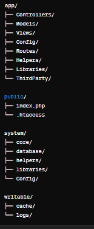

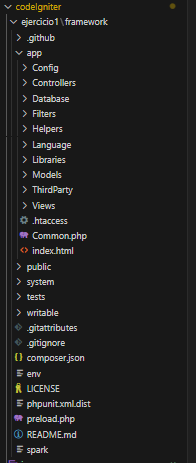

# Archivo .env en CodeIgniter

El archivo `.env` es un archivo de configuración utilizado en CodeIgniter para definir variables de entorno y ajustes específicos de la aplicación. Contiene información sensible y parámetros que pueden variar entre entornos, como configuraciones de la base de datos, claves de cifrado y otras variables de configuración.

## Activación del Archivo .env

Para activar el archivo `.env` en tu aplicación CodeIgniter, debes asegurarte de que el paquete `vlucas/phpdotenv` esté instalado. Puedes instalarlo utilizando Composer ejecutando el siguiente comando en tu terminal:

```bash
composer require vlucas/phpdotenv
```

Una vez instalado, debes cargar y cargar las variables de entorno del archivo .env en tu aplicación. Esto generalmente se hace en el archivo index.php ubicado en el directorio public de tu aplicación, añadiendo las siguientes líneas al principio del archivo:

```php
<?php

// Carga la librería dotenv
$dotenv = Dotenv\Dotenv::createImmutable(__DIR__ . '/../');
$dotenv->load();

```

## Contenido del Archivo .env

El archivo .env contiene variables de entorno en el formato NOMBRE=VALOR. Aquí hay algunos ejemplos de configuraciones comunes que puedes encontrar en este archivo:

- **CI_ENVIRONMENT**: Define el entorno en el que se ejecuta la aplicación (por ejemplo, development, testing, production).
- **DATABASE_HOST**: El host de la base de datos.
- **DATABASE_NAME**: El nombre de la base de datos.
- **DATABASE_USER**: El nombre de usuario de la base de datos.
- **DATABASE_PASS**: La contraseña de la base de datos.
- **APP_KEY**: La clave de cifrado de la aplicación.
- **SESSION_DRIVER**: El controlador de sesión utilizado por la aplicación.
- **BASE_URL**: La URL base de la aplicación.
  Es importante mantener este archivo seguro y no incluirlo en tu repositorio de código para proteger la información sensible que contiene.

> Este archivo esta incluido en git ignore por defecto

# Herramienta de Línea de Comandos de CodeIgniter spark

Proporciona utilidades para la gestión de la aplicación, incluyendo la instalación de componentes, ejecución de migraciones de bases de datos, generación de claves de cifrado, limpieza de caché y verificación de requisitos del sistema.

```plaintext

# Instalación de Componentes
spark install <nombre-componente>

# Ejecución de Migraciones de Bases de Datos
spark migrate

# Generación de Claves de Cifrado
spark key:generate

# Limpiar Caché y Archivos Temporales
spark clean

# Verificar Requisitos del Sistema
spark doctor

```

# Configuración inicial

## Configuración Inicial del Archivo app.php

El archivo `app.php` es uno de los archivos de configuración clave en una aplicación de CodeIgniter 4. Contiene varias configuraciones importantes para tu aplicación. A continuación, se describen algunas de las configuraciones más relevantes:

- **baseURL**: Define la URL base de tu aplicación.

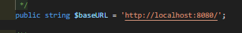

remplazar por la dirección de tu carpeta public

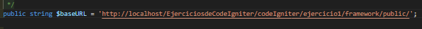

- **defaultLocale**: Idioma local de tu aplicación
  Los idiomas se almacenan en app/Language algunos requieren instalación

- **indexPage**: Especifica el nombre del archivo de entrada en las URL generadas por CodeIgniter.
- **uriProtocol**: Define el método que CodeIgniter usará para determinar la URI de la solicitud.
- **timezone**: Configura la zona horaria predeterminada para tu aplicación.
- **app.baseURL**: Alternativa para configurar la URL base de la aplicación.
- **app.salt**: Se utiliza para cifrar cookies y otras cadenas sensibles en tu aplicación.
- **app.CSRFTokenName** y **app.CSRFHeaderName**: Define el nombre del token CSRF y el nombre del encabezado HTTP donde se enviará el token CSRF.
- **app.publicFilters**: Permite especificar qué filtros de autorización se aplicarán a todas las rutas de tu aplicación de forma global.

Estas son algunas de las configuraciones más comunes que puedes encontrar en el archivo `app.php`. Es importante revisar este archivo y ajustar las configuraciones según las necesidades específicas de tu aplicación. ¡Recuerda siempre mantener seguro este archivo y no incluir información sensible en él!

## Configuración del Archivo Database.php

El archivo `Database.php` es otro archivo de configuración importante en una aplicación de CodeIgniter 4. Se encuentra en el directorio `app/Config` y se utiliza para configurar la conexión a la base de datos y otros ajustes relacionados con la base de datos. A continuación, se describen algunas de las configuraciones más relevantes que puedes encontrar en este archivo:

- **default**: Define la configuración predeterminada de la base de datos que se utilizará en toda la aplicación.
- **hostname**: El nombre del host de la base de datos.
- **username**: El nombre de usuario de la base de datos.
- **password**: La contraseña de la base de datos.
- **database**: El nombre de la base de datos.
- **DBDriver**: El controlador de la base de datos que se utilizará.
- **DBPrefix**: Un prefijo opcional que se añadirá a los nombres de las tablas en la base de datos.
- **pConnect**: Un valor booleano que indica si se deben utilizar conexiones persistentes.
- **DBDebug**: Un valor booleano que indica si se deben mostrar mensajes de depuración de la base de datos.
- **cacheOn**: Un valor booleano que indica si se debe habilitar la caché de consultas de la base de datos.
- **cacheDir**: La ubicación del directorio de caché de consultas de la base de datos.
- **cacheAutoClear**: Un valor booleano que indica si se debe limpiar automáticamente la caché de consultas de la base de datos.
- **charset** y **DBCollat**: La configuración del juego de caracteres y la colación de la base de datos.
- **swapPre**: Un prefijo opcional que se utilizará en lugar del prefijo predeterminado en las consultas.

Estas son algunas de las configuraciones más comunes que puedes encontrar en el archivo `Database.php`. Es importante revisar este archivo y ajustar las configuraciones según las necesidades específicas de tu aplicación y tu entorno de base de datos. ¡Asegúrate de mantener seguras las credenciales de tu base de datos y de no incluirlas en el control de versiones!

# Configuración del modo de desarrollo

De forma predeterminada, CodeIgniter se inicia en modo de producción. Esta es una característica de seguridad para mantener su sitio un poco más seguro en caso de que la configuración se estropee una vez que esté activa. Así que primero vamos a arreglar eso. Copie o cambie el nombre del archivo env a .env. Ábrelo.

Este archivo contiene la configuración específica del servidor. Esto significa que nunca tendrá que hacerlo Confirme cualquier información confidencial en su sistema de control de versiones. Incluye: Algunos de los más comunes ya quieres entrar, aunque todos están comentados fuera. Así que descomente la línea con en ella y cámbiela a:CI_ENVIRONMENTproductiondevelopment

CI_ENVIRONMENT = development

# Patrón MVC (Modelo-Vista-Controlador) 🌟

## ¿Qué es MVC? 🤔

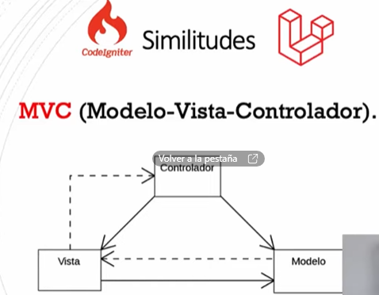

MVC es un **patrón de diseño de software** que separa una aplicación en tres componentes principales: **Modelo**, **Vista** y **Controlador**. Esta separación facilita la gestión del código y mejora la Escalabilidad y el mantenimiento de la aplicación. Vamos a ver cada componente en detalle. 🔍

### Componentes de MVC 🧩

Los modelos administran los datos de la aplicación y ayudan a aplicar las reglas de negocio especiales que la aplicación pueda necesitar.

Las vistas son archivos simples, con poca o ninguna lógica, que muestran la información al usuario.

Los controladores actúan como código de unión, serializando los datos de un lado a otro entre la vista (o el usuario que la está viendo) y el almacenamiento de datos.

1. **Modelo (Model) 🗃️**

   - **Función**: Gestiona los datos y la lógica de negocio. Representa la información (datos) que la aplicación utiliza y su lógica.
   - **Ejemplos**: Clases de base de datos, lógica de validación, reglas de negocio.
   - **Responsabilidades**:
     - Acceso y manipulación de datos.
     - Notificar a la vista cuando los datos cambian.

2. **Vista (View) 👀**

   - **Función**: Se encarga de la presentación de los datos. Es la interfaz de usuario (UI) de la aplicación.
   - **Ejemplos**: Archivos HTML, CSS, plantillas que renderizan datos.
   - **Responsabilidades**:
     - Mostrar datos del modelo al usuario.
     - Enviar las interacciones del usuario al controlador.

3. **Controlador (Controller) 🎮**
   - **Función**: Actúa como un intermediario entre el modelo y la vista. Gestiona la lógica de aplicación y las entradas del usuario.
   - **Ejemplos**: Métodos que reciben solicitudes HTTP, lógica de flujo de aplicación.
   - **Responsabilidades**:
     - Recibir entradas del usuario desde la vista.
     - Procesar la entrada (validar, interactuar con el modelo).
     - Actualizar la vista con los datos procesados.

### Flujo de Trabajo en MVC 🚦

1. **El Usuario Interactúa con la Vista**: Por ejemplo, el usuario hace clic en un botón o envía un formulario.
2. **La Vista Envía la Solicitud al Controlador**: La solicitud del usuario es capturada por el controlador.
3. **El Controlador Procesa la Solicitud**:
   - Valida y procesa la entrada.
   - Interactúa con el modelo para obtener o modificar datos.
4. **El Modelo Actualiza los Datos**: Si hay cambios en los datos, el modelo los procesa y actualiza.
5. **El Modelo Notifica a la Vista**: El modelo informa a la vista sobre los cambios en los datos.
6. **La Vista se Actualiza**: La vista muestra la información actualizada al usuario.

```txt

Flujo de MVC

 +---------------+
  |     Usuario   |
  +-------+-------+
          |
          v
  +-------+-------+
  |     Vista     |
  +-------+-------+
          |
          v
  +-------+-------+
  |  Controlador  |
  +-------+-------+
          |
          v
  +-------+-------+
  |     Modelo    |
  +-------+-------+
          |
          v
  +-------+-------+
  |     Datos     |
  +---------------+
```

### Descripción del Flujo 🔄

1. **Usuario Interactúa con la Vista**:

   - El usuario realiza una acción (como hacer clic en un botón o enviar un formulario).

2. **Vista Envía la Solicitud al Controlador**:

   - La vista captura la acción del usuario y envía una solicitud al controlador correspondiente.

3. **Controlador Procesa la Solicitud**:

   - El controlador recibe la solicitud, procesa la entrada (validación, lógica de negocio) e interactúa con el modelo para obtener o modificar datos.

4. **Modelo Actualiza los Datos**:

   - El modelo gestiona los datos (acceso a base de datos, lógica de negocio) y actualiza el estado de los datos si es necesario.

5. **Modelo Notifica a la Vista**:

   - El modelo puede notificar a la vista que los datos han cambiado o devolver los datos procesados al controlador.

6. **Vista se Actualiza**:
   - La vista toma los datos del modelo (directamente o a través del controlador) y actualiza la interfaz de usuario para reflejar los cambios.

### Diagrama detallado

```txt

+---------------+      1. Interacción del usuario     +---------------+
|     Usuario   | ----------------------------------> |     Vista     |
+---------------+                                     +---------------+
        ^                                                      |
        |                                                      v
        |                                           2. Solicitud del usuario
        |                                           a través de la vista
        |                                                      |
        |                                                      v
+---------------+                                     +---------------+
|    Controlador| <--------------------------------- |     Vista     |
+---------------+       3. Envío de solicitud        +---------------+
        |                                                      |
        |                                                      v
        |  4. Interacción con el modelo para obtener           |
        |  o modificar datos                                    |
        |                                                      v
+---------------+                                     +---------------+
|     Modelo    | <--------------------------------- |  Controlador  |
+---------------+       5. Envío de datos            +---------------+
        |                                                      |
        |                                                      v
        |     6. Actualización de la vista con los datos       |
        |     obtenidos/modificados                            |
        |                                                      v
+---------------+                                     +---------------+
|     Datos     |                                     |     Vista     |
+---------------+                                     +---------------+
        ^
        |
+---------------+
|     Usuario   |
+---------------+

```

### Ventajas del MVC 🌟

- **Separación de Responsabilidades**: Facilita la colaboración entre desarrolladores que trabajan en la lógica, diseño y flujo de la aplicación.
- **Escalabilidad**: Cada componente puede ser modificado independientemente.
- **Reutilización del Código**: Componentes como las vistas y modelos pueden ser reutilizados en diferentes partes de la aplicación.
- **Mantenimiento**: Más fácil de mantener y depurar debido a la separación de preocupaciones.

### Desventajas del MVC 😕

- **Complejidad**: Puede ser más complejo y tener una curva de aprendizaje para principiantes.
- **Sobrecarga**: Para aplicaciones simples, el MVC puede ser una sobrecarga innecesaria.

### Ejemplos de Uso 🌐

- **Frameworks**:

  - **Django** (Python) 🐍
  - **Ruby on Rails** (Ruby) 💎
  - **ASP.NET MVC** (C#) 🖥️
  - **Laravel** (PHP) 🐘
  - **Spring MVC** (Java) ☕

- **Librerías/Frameworks Frontend**:
  - **Angular** y **React** se basan en conceptos similares, aunque a menudo utilizan variaciones como MVM (Model-View-ViewModel) o componentes.

# Controllers

En CodeIgniter 4, los controladores siguen siendo una parte esencial del patrón de diseño MVC (Modelo-Vista-Controlador). Sin embargo, hay algunas mejoras y cambios significativos en comparación con las versiones anteriores. Los controladores en CodeIgniter 4 actúan como intermediarios entre los modelos, las vistas y cualquier otra clase de procesamiento.

## Creación de un Controlador

```php
<?php

// Definimos el namespace para la clase. En este caso, la clase MiControlador pertenece al namespace App\Controllers.
namespace App\Controllers;

// Importamos la clase Controller de CodeIgniter para que nuestra clase MiControlador pueda extenderla.
use CodeIgniter\Controller;

// Definimos la clase MiControlador y la hacemos extender de la clase Controller de CodeIgniter.
class MiControlador extends Controller {

    // Definimos el método index, que será la acción por defecto del controlador.
    public function index() {
        // Retornamos un saludo simple.
        return "¡Hola, mundo!";
    }
}
```

- **Namespace**: Utiliza namespace App\Controllers;.
- **Extender Controller**: Tu clase debe extender CodeIgniter\Controller.

## Funciones de un Controlador

Las funciones (también llamadas métodos) dentro de un controlador se corresponden con las acciones que el controlador puede realizar.

```php
public function mostrarMensaje() {
    return "Este es un mensaje desde el controlador.";
}
```

> Para acceder a esta función, irías a <http://tusitio.com/miControlador/mostrarMensaje>.

## Cargar Vistas en el Controlador

Para cargar una vista desde un controlador, utiliza el método return view.

```php
public function mostrarVista() {
    return view('mi_vista');
}
```

## Pasar Datos a la Vista

Puedes pasar datos a la vista usando un array asociativo.

```php
// Definimos un método público llamado mostrarVistaConDatos en nuestra clase.
public function mostrarVistaConDatos() {
    // Creamos un array asociativo llamado $data que contiene los datos que queremos pasar a la vista.
    $data = [
        'titulo' => 'Título de la página', // Definimos una variable 'titulo' con el valor 'Título de la página'.
        'mensaje' => 'Mensaje para la vista' // Definimos una variable 'mensaje' con el valor 'Mensaje para la vista'.
    ];
    // Utilizamos la función view() para cargar la vista 'mi_vista' y pasamos el array $data como segundo parámetro.
    // Esto permite que los datos estén disponibles en la vista para su uso.
    return view('mi_vista', $data);
}

```

En la vista, puedes acceder a estos datos como variables.

```html
<html>
  <head>
    <title><?= $titulo ?></title>
  </head>
  <body>
    <p><?= $mensaje ?></p>
  </body>
</html>
```

## Cargar Modelos en el Controlador

```php
// Importamos el modelo MiModelo ubicado en el namespace App\Models.
use App\Models\MiModelo;

// Definimos el constructor de la clase.
public function __construct() {
    // En el constructor, creamos una instancia del modelo MiModelo y la asignamos a la propiedad $miModelo.
    $this->miModelo = new MiModelo();
}

// Definimos un método público llamado usarModelo en nuestra clase.
public function usarModelo() {
    // Llamamos al método obtenerDatos() del modelo MiModelo para obtener los datos que queremos utilizar en la vista.
    $datos = $this->miModelo->obtenerDatos();
    // Utilizamos la función view() para cargar la vista 'vista_datos' y pasamos los datos obtenidos del modelo como un array asociativo.
    return view('vista_datos', ['datos' => $datos]);
}

```

## Redireccionar en un Controlador

Para redireccionar desde un controlador, usa el helper redirect.

```php
// Definimos un método público llamado redireccionar en nuestra clase.
public function redireccionar() {
    // Utilizamos el helper redirect() para generar una redirección en CodeIgniter.
    // La función to() especifica la URL a la que se redireccionará.
    return redirect()->to('/otraControlador/otraFuncion');
}

```

## Controladores RESTful

CodeIgniter 4 facilita la creación de APIs RESTful. Puedes extender la clase CodeIgniter\RESTful\ResourceController.

```php
// Definimos el namespace para la clase. En este caso, la clase MiApi pertenece al namespace App\Controllers.
namespace App\Controllers;

// Importamos la clase ResourceController de CodeIgniter para que nuestra clase MiApi pueda extenderla.
use CodeIgniter\RESTful\ResourceController;

// Definimos la clase MiApi y la hacemos extender de la clase ResourceController de CodeIgniter.
class MiApi extends ResourceController {

    // Definimos el método index, que será la acción por defecto del controlador para la API.
    public function index() {
        // Retornamos una respuesta JSON con un mensaje simple.
        return $this->respond(['mensaje' => 'Hola desde la API']);
    }
}
```

## Seguridad en los Controladores

- **Filtrado de Entrada**: Usa las funciones de CodeIgniter para sanitizar datos ($this->request->getPost(), $this->request->getGet()).
- **Validación de Formulario**: Utiliza la librería Validation para validar datos de entrada.
- **Autorización**: Implementa mecanismos de control de acceso para proteger tus controladores y métodos.

> Los controladores en CodeIgniter 4 han evolucionado para ser más robustos y flexibles, facilitando el desarrollo de aplicaciones modernas y escalables. Al comprender y utilizar estos conceptos, puedes maximizar el potencial de CodeIgniter 4 en tus proyectos. 🚀✨

## Ejemplo de un Controlador

```php
// Definimos el namespace para la clase. En este caso, la clase Home pertenece al namespace App\Controllers.
namespace App\Controllers;

// Importamos la clase BaseController para que nuestra clase Home pueda extenderla.
use App\Controllers\BaseController;

// Definimos la clase Home y la hacemos extender de la clase BaseController.
class Home extends BaseController
{
    // Definimos el método index, que será la acción por defecto del controlador para la página de inicio.
    // Se especifica que el método devuelve una cadena de texto.
    public function index(): string
    {
        // Retornamos la vista 'welcome_message'.
        return view('welcome_message');
    }
}
```

# Explicación de la Clase BaseController

La clase `BaseController` es una clase base proporcionada por CodeIgniter que ofrece un lugar conveniente para cargar componentes y realizar funciones que son necesarias en todos tus controladores. Aquí tienes una explicación detallada de cada parte de esta clase:

1. **Namespace**: La clase `BaseController` está definida en el namespace `App\Controllers`, lo que significa que pertenece al directorio `app/Controllers` de tu aplicación.

2. **Importaciones**: La clase `BaseController` importa varias clases y interfaces de CodeIgniter y del estándar PSR-3 para manejo de registros de logs. Estas importaciones permiten el uso de clases y herramientas necesarias para la construcción de controladores.

3. **Comentarios de Documentación**: La clase `BaseController` incluye comentarios de documentación que describen su propósito y su uso. Estos comentarios son útiles para entender rápidamente la función y la forma de utilizar la clase.

4. **Clase Abstracta**: La clase `BaseController` es abstracta, lo que significa que no puede ser instanciada directamente. Debe ser extendida por otras clases para ser utilizada.

5. **Propiedad `$request`**: Esta propiedad representa la instancia del objeto Request principal que se utiliza para manejar la solicitud HTTP. Puede ser una instancia de `CLIRequest` para solicitudes de línea de comandos o `IncomingRequest` para solicitudes HTTP entrantes.

6. **Propiedad `$helpers`**: Esta propiedad es un array que contiene los nombres de los helpers que se cargarán automáticamente al instanciar una clase que extienda `BaseController`. Los helpers proporcionan funciones útiles que pueden ser utilizadas en los controladores.

7. **Método `initController()`**: Este método es llamado automáticamente por CodeIgniter después de instanciar un controlador. Se encarga de inicializar el controlador y establecer los objetos necesarios como el Request, Response y Logger. Puedes agregar lógica adicional en este método para pre-cargar modelos, librerías, etc.

La clase `BaseController` es una clase base fundamental en CodeIgniter que proporciona funcionalidades comunes y configuraciones básicas para todos los controladores de tu aplicación. Al extender esta clase en tus controladores, puedes aprovechar estas funcionalidades sin necesidad de repetir código en cada controlador individualmente.

Este es el archivo en español

```php
<?php

namespace App\Controllers;

use CodeIgniter\Controller;
use CodeIgniter\HTTP\CLIRequest;
use CodeIgniter\HTTP\IncomingRequest;
use CodeIgniter\HTTP\RequestInterface;
use CodeIgniter\HTTP\ResponseInterface;
use Psr\Log\LoggerInterface;

/**
 * Clase BaseController
 *
 * BaseController proporciona un lugar conveniente para cargar componentes
 * y realizar funciones que son necesarias para todos tus controladores.
 * Extiende esta clase en cualquier controlador nuevo:
 *     class Home extends BaseController
 *
 * Por seguridad, asegúrate de declarar cualquier método nuevo como protegido o privado.
 */
abstract class BaseController extends Controller
{
    /**
     * Instancia del objeto de solicitud principal.
     *
     * @var CLIRequest|IncomingRequest
     */
    protected $request;

    /**
     * Un array de helpers para ser cargados automáticamente al
     * instanciar la clase. Estos helpers estarán disponibles
     * para todos los demás controladores que extiendan BaseController.
     *
     * @var list<string>
     */
    protected $helpers = [];

    /**
     * Asegúrate de declarar propiedades para cualquier propiedad que inicialices.
     * La creación de propiedades dinámicas está obsoleta en PHP 8.2.
     */
    // protected $session;

    /**
     * @return void
     */
    public function initController(RequestInterface $request, ResponseInterface $response, LoggerInterface $logger)
    {
        // No Edites Esta Línea
        parent::initController($request, $response, $logger);

        // Precarga cualquier modelo, biblioteca, etc., aquí.

        // Ejemplo: $this->session = \Config\Services::session();
    }
}
```

El controlador prácticamente es el que decide que se tiene que hacer según una url o rutas

# Enrutamiento en CodeIgniter 4

En CodeIgniter 4, el enrutamiento se define en el archivo `Routes.php` en el directorio `app/Config`.

## Definición de rutas

```php
<?php

namespace Config;

use CodeIgniter\Routing\RouteCollectionInterface;
use CodeIgniter\Routing\Router;

// Crear una nueva instancia del enrutador de CodeIgniter
$routes = new Router();

// Definir el controlador predeterminado que se cargará si no se proporciona ninguna URI
$routes->setDefaultController('Inicio');

// Definir una ruta para la página de inicio, donde '/' representa la raíz del sitio web
$routes->get('/', 'Inicio::index');

// Definir una ruta para mostrar un usuario específico, donde 'usuarios/(:num)' captura un número como parámetro
// y lo pasa al método 'mostrar' del controlador 'Usuarios'
$routes->get('usuarios/(:num)', 'Usuarios::mostrar/$1');

// Definir un grupo de rutas para el panel de administración, que tendrá un prefijo 'admin' para todas las rutas dentro del grupo
$routes->group('admin', function (RouteCollectionInterface $routes) {
    // Agregar una ruta para el dashboard del panel de administración
    $routes->add('dashboard', 'Admin::dashboard');
    // Agregar una ruta para la gestión de usuarios dentro del panel de administración
    $routes->add('usuarios', 'Admin::usuarios');
});

// Configurar una redirección desde una URL antigua a una nueva
$routes->redirect('old-url', 'new-url');
```

### Secciones de una Ruta en CodeIgniter 4

1. **Método HTTP**: Las rutas en CodeIgniter 4 comienzan generalmente con un método HTTP, como `get`, `post`, `put`, `delete`, etc. Este método especifica el tipo de solicitud HTTP que coincide con la ruta.

   Ejemplo:

   ```php
   $routes->get('/', 'Inicio::index');

   ```

   Aquí, get indica que esta ruta se activará cuando se reciba una solicitud GET a la raíz del sitio web (/).

2. URI (Identificador Uniforme de Recurso): Es la parte de la URL después del nombre de dominio. Puede contener segmentos de la URL que se deben coincidir para que se active la ruta.

Ejemplo:

```php
$routes->get('usuarios/(:num)', 'Usuarios::mostrar/$1');
```

En esta ruta, /usuarios/(:num) especifica que la ruta se activará cuando la URL coincida con /usuarios/ seguido de un número.

3. Controlador y Método: Especifica el controlador y el método que manejarán la solicitud cuando se active la ruta. En CodeIgniter, los controladores se encuentran típicamente en el directorio app/Controllers.

Ejemplo:

```php
'Usuarios::mostrar/$1'
```

Aquí, Usuarios es el nombre del controlador y mostrar es el nombre del método dentro del controlador que manejará la solicitud. $1 es un marcador de posición para el primer parámetro capturado en la URI.

## Tipos de enrutamientos

### Enrutamiento Automático

En CodeIgniter, el enrutamiento automático es el enfoque predeterminado que sigue una convención de nomenclatura para dirigir las solicitudes HTTP a los controladores y métodos correspondientes.

Convención de Nomenclatura: Para el enrutamiento automático, CodeIgniter asume que la primera parte de la URL (después del dominio) corresponde al nombre del controlador, y la segunda parte (si existe) corresponde al nombre del método dentro de ese controlador. Por ejemplo:

```ruby
http://ejemplo.com/controlador/metodo/parametros
```

Controladores y Métodos: Los controladores deben ubicarse en el directorio app/Controllers, y los métodos dentro de estos controladores deben ser públicos y accesibles.

### Enrutamiento Manual

El enrutamiento manual te permite definir rutas personalizadas en el archivo Routes.php para dirigir las solicitudes a controladores y métodos específicos según tus necesidades.

Archivo Routes.php: En CodeIgniter, el archivo Routes.php ubicado en app/Config es donde defines tus rutas manualmente.

Método add(): Utilizas el método add() del enrutador para definir tus rutas. Puedes especificar la URI y el controlador/método correspondiente para cada ruta.

```php
$routes->get('ruta', 'Controlador::metodo');
```

Flexibilidad: El enrutamiento manual te brinda más flexibilidad para definir reglas de enrutamiento personalizadas, incluidos prefijos, restricciones de parámetros, grupos de rutas y redireccionamientos.

### ¿Cuándo Usar Cada Tipo?

- Enrutamiento Automático: Es útil cuando sigues la convención de nomenclatura predeterminada y no necesitas reglas de enrutamiento personalizadas.

- Enrutamiento Manual: Se utiliza cuando necesitas reglas de enrutamiento personalizadas, como redireccionamientos, rutas con parámetros dinámicos, o cuando deseas agrupar y organizar tus rutas de una manera específica.

### Métodos Relacionados con el Enrutamiento Automático en CodeIgniter

1. **`setDefaultNamespace($value)`**: Este método se utiliza para establecer el espacio de nombres predeterminado para los controladores.

2. **`setDefaultController($controller)`**: Se utiliza para establecer el controlador predeterminado que se cargará si no se proporciona ninguna URI.

3. **`setDefaultMethod($method)`**: Define el método predeterminado que se ejecutará si no se proporciona un método en la URI.

4. **`setTranslateURIDashes($translate)`**: Con este método, puedes habilitar o deshabilitar la traducción automática de guiones en las URIs a nombres de controlador y método.

5. **`set404Override($override)`**: Con esta función, puedes habilitar o deshabilitar la anulación de la página 404 predeterminada de CodeIgniter.

6. **`setAutoRoute($value)`**: Este método permite habilitar o deshabilitar el enrutamiento automático. Cuando está habilitado, CodeIgniter intentará enrutamiento automático según la URI proporcionada.

Estos métodos te proporcionan control sobre el enrutamiento automático en CodeIgniter, permitiéndote configurar el comportamiento predeterminado de tu aplicación web.

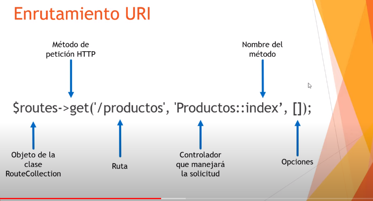

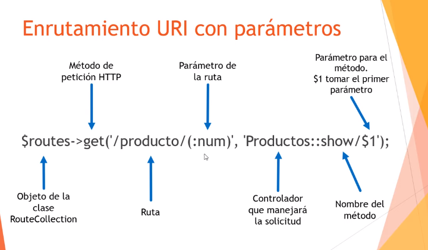

Función con parámetros

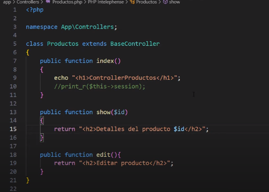

Ruta

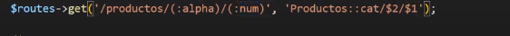

Controlador

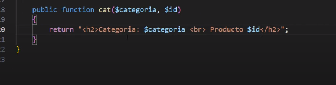

Se puede hacer limitando el rango del valor de los parámetros en este caso limitamos solo dígitos del 0 al 9 y que mínimo tengan 2 cifras

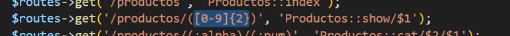

Rutas hacia una vista

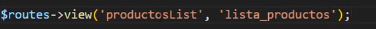

En este caso llamamos a una vista y le pasamos parámetros

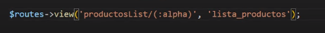

Desde la cista lo podemos recibir de esta manera

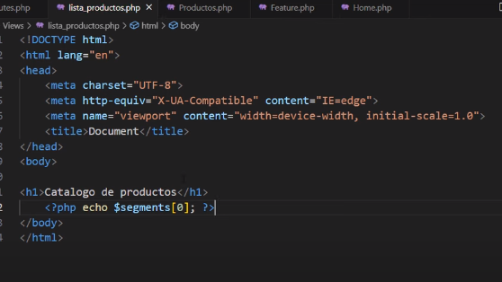

Se pueden hacer Grupos de Rutas

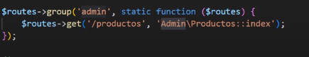

# Vistas

## Introducción a las Vistas en CodeIgniter 4

**¿Qué son las vistas en CodeIgniter 4?**
Las vistas son componentes esenciales que se utilizan para presentar datos al usuario final de una aplicación web en el patrón de diseño Modelo-Vista-Controlador (MVC). Permiten la separación de la lógica de presentación de la lógica de negocio y la manipulación de datos.

**¿Cómo se usan las vistas en CodeIgniter 4?**

1. **Creación de vistas:** Se crean como archivos individuales con la extensión `.php` en el directorio `app/Views`.
2. **Pasando datos a las vistas:** Los controladores pueden pasar datos a las vistas utilizando un arreglo asociativo o un objeto como parámetro al cargar la vista.
3. **Cargando vistas:** Se cargan desde los controladores utilizando el método `view()` proporcionado por la clase `CodeIgniter\View\View`.

   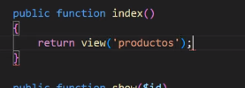

   si tu vista esta en una subcarpeta es necesario especificarla

   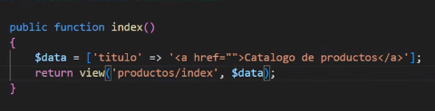

Automáticamente la función busca dentro de nuestra carpeta de vistas

4. **Renderizando vistas parciales:** Se pueden renderizar vistas parciales o fragmentos de HTML utilizando el método `renderSection()`.

**¿Qué se puede hacer con las vistas en CodeIgniter 4?**

1. **Mostrar datos dinámicos:** Pueden mostrar datos dinámicos provenientes de diversas fuentes.
2. **Crear interfaces de usuario interactivas:** Pueden contener formularios, botones y otros elementos interactivos.
3. **Reutilizar código HTML:** Permiten la reutilización de código HTML mediante la inclusión de otras vistas parciales o fragmentos.
4. **Aplicar lógica de presentación:** Pueden contener lógica de presentación para mostrar elementos según condiciones específicas.

# Mandar información del controlador a la vista

En el controlador

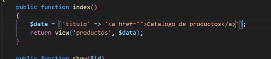

En la Vista

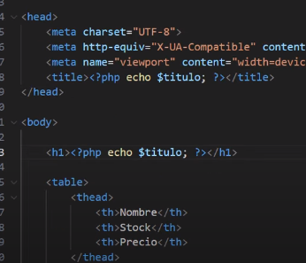

Se puede recibir e imprimir con un echo para que se respeten las etiquetas html

Y también se puede pasar como texto plano esto con la función
esc()

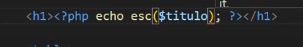
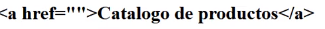

# Retornar mas de una vista

Desde el controlador podemos mandar a llamar mas de una vista y de diferentes maneras ya sea
con echo

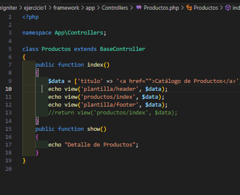

o con return

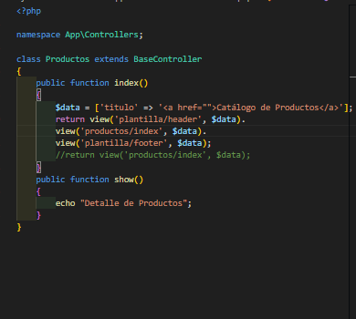

# Layouts

## Implementación de un Layout en CodeIgniter

En CodeIgniter, un **layout** es una estructura base para las vistas de tu aplicación web. Los layouts permiten definir una plantilla común que puede ser reutilizada en diferentes vistas, asegurando consistencia en el diseño y facilitando el mantenimiento del código.

## 1. Creación del Layout Principal

Generalmente, creas una vista principal que contiene la estructura básica de tu página, como la cabecera, pie de página y secciones comunes. Puedes llamarla `layout.php` y colocarla en la carpeta de vistas (`application/views/`).

```html
<!-- application/views/layout.php -->
<!DOCTYPE html>
<html lang="en">
  <head>
    <meta charset="UTF-8" />
    <title><?= $title; ?></title>
    <!-- Incluye tus archivos CSS aquí -->
  </head>
  <body>
    <header>
      <h1>Mi Aplicación Web</h1>
      <!-- Menú de navegación, etc. -->
    </header>
    <main>
      <?= $content; ?>
    </main>
    <footer>
      <p>&copy; 2024 Mi Aplicación Web</p>
    </footer>
    <!-- Incluye tus archivos JavaScript aquí -->
  </body>
</html>
```

## 2. Uso del Layout en un Controlador

En tu controlador, cargas las vistas específicas y las pasas a través del layout.

```php
// app/Controllers/Home.php
namespace App\Controllers;

class Home extends BaseController {
    public function index() {
        $data['title'] = 'Bienvenido a CodeIgniter 4';
        return view('home', $data);
    }
}
```

## 3. Creación de Vistas Específicas

Crea las vistas específicas que deseas mostrar dentro del layout. Por ejemplo, home.php.

```php
<!-- app/Views/home.php -->
<?= $this->extend('layout'); ?>

<?= $this->section('content'); ?>
<h2>¡Hola, mundo!</h2>
<p>Bienvenido a mi aplicación web construida con CodeIgniter 4.</p>
<?= $this->endSection(); ?>
```

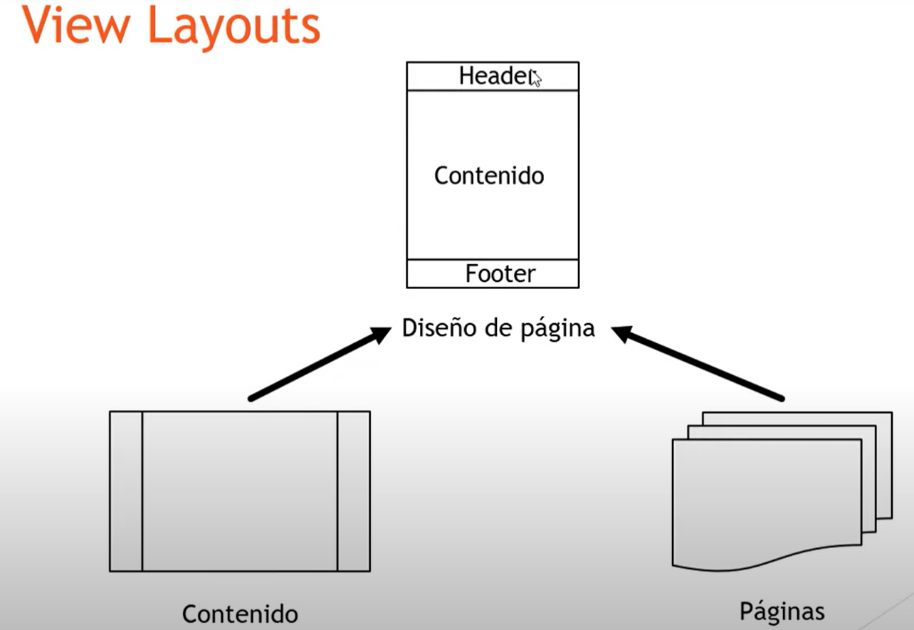

## Ejemplo de Layout

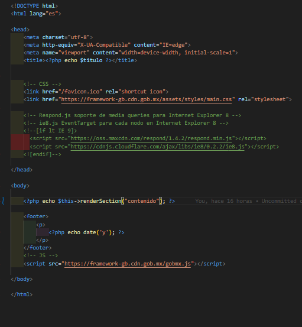

Esta es una estructura básica de una plantilla html

en la cual imprimimos con echo una sección para renderizar llamada contenido

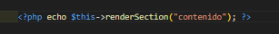

este layout lo vamos a llamar desde una vista
con

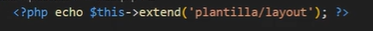

Y vamos a crear la sección de codigo que vamos a enviar como contenido de nuestra layout

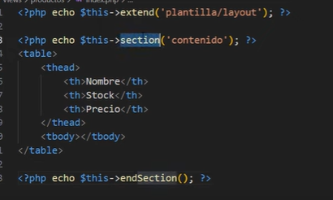

Dentro del controlador retornamos la vista

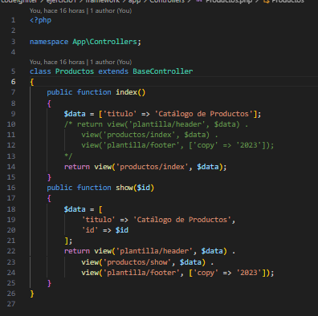

## Llamar una vista desde el layout

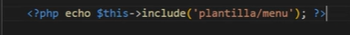

# Conexión a Base de Datos

Lo primero es configurar nuestras credenciales de acceso en el archivo .env que se sobre escribe a los demás archivos de configuración

El siguiente paso es
crear una variable para almacenar las credenciales de conexión

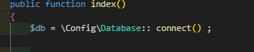

en otra variable guardamos la query o consulta

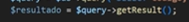

```php
<?php

// Definimos el namespace de la clase para mantener el código organizado y evitar conflictos de nombres.
namespace App\Controllers;

// Definimos la clase Productos que extiende de BaseController, la clase base para los controladores en CodeIgniter.
class Productos extends BaseController
{
    // Método index, que se ejecuta cuando se accede al controlador sin especificar un método.
    public function index()
    {
        // Conectamos a la base de datos usando la configuración predeterminada.
        $db = \Config\Database::connect();

        // Ejecutamos una consulta SQL para seleccionar el código, nombre y stock de la tabla productos.
        $query = $db->query("SELECT codigo, nombre, stock FROM productos");

        // Obtenemos los resultados de la consulta en forma de un array de objetos.
        $resultado = $query->getResult();

        // Preparamos un array asociativo con datos para pasarlos a la vista.
        $data = ['titulo' => 'Catálogo de Productos', 'productos' => $resultado];

        // Cargamos la vista 'productos/index' y le pasamos los datos.
        return view('productos/index', $data);
    }
}
```

en la vista podemos utilizar los lops valores retornados de la siguiente manera

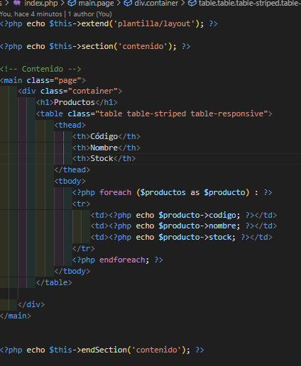

el resultado también puede ser retornado como un arreglo

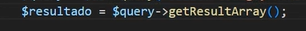

si es de esta manera en tu vista tienes que utilizar indices para consultar los datos del resultado retornado como arreglo

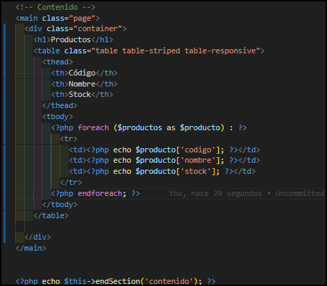

# Modelos en CodeIgniter 4

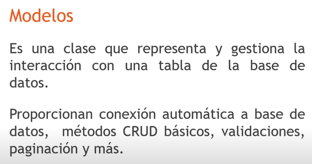

## ¿Qué son los Modelos en CodeIgniter 4? 🛠️

Los Modelos en CodeIgniter 4 son componentes que manejan la lógica de acceso a datos y la interacción con la base de datos. Son responsables de realizar operaciones como crear, leer, actualizar y eliminar (CRUD) registros en la base de datos.

## ¿Para qué se usan los Modelos? 🎯

1. **Organización del Código**: Separan la lógica de negocio de la lógica de presentación.
2. **Reutilización**: Facilitan la reutilización de la lógica de acceso a datos en diferentes partes de la aplicación.
3. **Abstracción**: Abstraen la complejidad de las operaciones de base de datos, proporcionando métodos fáciles de usar para interactuar con los datos.

## Cómo Usar los Modelos en CodeIgniter 4 📝

### Crear un Modelo

Para crear un modelo en CodeIgniter 4, necesitas crear una clase que extienda `CodeIgniter\Model`. Aquí hay un ejemplo:

```php
<?php

namespace App\Models;

use CodeIgniter\Model;

class UsuarioModel extends Model
{
    protected $table = 'usuarios';
    protected $primaryKey = 'id';
    protected $allowedFields = ['nombre', 'email', 'contraseña'];
}
```

## Usar un Modelo

Para usar un modelo en tu controlador, primero necesitas cargarlo. Aquí hay un ejemplo de cómo hacerlo:

```php

<?php
namespace App\Controllers;
use App\Models\UsuarioModel;

class UsuarioController extends BaseController
{
    public function index()
    {
        $usuarioModel = new UsuarioModel();
        $data['usuarios'] = $usuarioModel->findAll();

        return view('usuarios/index', $data);
    }
}
```

## Métodos Comunes de los Modelos 📚

1. find($id): Obtiene un registro por su ID.
2. findAll(): Obtiene todos los registros.
3. insert($data): Inserta un nuevo registro.
4. update($id, $data): Actualiza un registro existente.
5. delete($id): Elimina un registro por su ID.

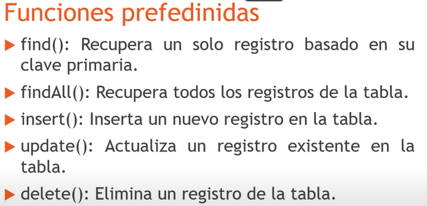

## Ejemplos de Uso 🧩

- Obtener Todos los Registros

```php
$usuarioModel = new UsuarioModel();
$usuarios = $usuarioModel->findAll();
```

- Obtener un Registro por ID

```php
$usuarioModel = new UsuarioModel();
$usuario = $usuarioModel->find(1);
```

- Insertar un Nuevo Registro

```php
$usuarioModel = new UsuarioModel();
$usuarioModel->insert([
    'nombre' => 'Juan Pérez',
    'email' => 'juan@example.com',
    'contraseña' => '123456'
]);
```

- Actualizar un Registro

```php
$usuarioModel = new UsuarioModel();
$usuarioModel->update(1, [
    'nombre' => 'Juan Pérez',
    'email' => 'juan.perez@example.com'
]);
```

- Eliminar un Registro

```php
$usuarioModel = new UsuarioModel();
$usuarioModel->delete(1);
```

## Configuración Adicional 🛠️

### Validación de Datos

Puedes configurar reglas de validación en tu modelo:

```php
<?php

namespace App\Models;
use CodeIgniter\Model;
class UsuarioModel extends Model
{
    protected $table = 'usuarios';
    protected $primaryKey = 'id';
    protected $allowedFields = ['nombre', 'email', 'contraseña'];

    protected $validationRules = [
        'nombre' => 'required|min_length[3]|max_length[255]',
        'email' => 'required|valid_email',
        'contraseña' => 'required|min_length[8]'
    ];
}
```

### Callbacks

Puedes usar callbacks para ejecutar funciones antes o después de ciertas operaciones:

```php
<?php
namespace App\Models;
use CodeIgniter\Model;

class UsuarioModel extends Model
{
    protected $table = 'usuarios';
    protected $primaryKey = 'id';
    protected $allowedFields = ['nombre', 'email', 'contraseña'];

    protected $beforeInsert = ['hashPassword'];

    protected function hashPassword(array $data)
    {
        if (isset($data['data']['contraseña'])) {
            $data['data']['contraseña'] = password_hash($data['data']['contraseña'], PASSWORD_DEFAULT);
        }

        return $data;
    }
}
```

> Los modelos en CodeIgniter 4 son una poderosa herramienta para manejar la lógica de acceso a datos de tu aplicación. Organizan y simplifican la interacción con la base de datos, permitiendo un código más limpio y mantenible.

## Propiedades de la tabla a consultar

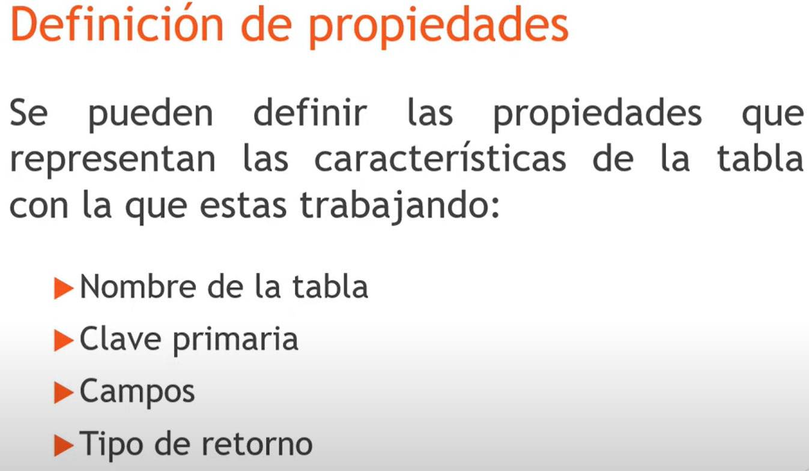

### ejemplo de un modelo

```php
<?php

// Definimos el espacio de nombres para esta clase, que está dentro de la carpeta App\Models
namespace App\Models;

// Importamos la clase Model de CodeIgniter para poder extenderla
use CodeIgniter\Model;

class ProductosModel extends Model
{
    // Nombre de la tabla en la base de datos que este modelo manejará
    protected $table      = 'productos';

    // Nombre de la columna que es la llave primaria de la tabla
    protected $primaryKey = 'idproductos';

    // Indicamos que la llave primaria utiliza auto-incremento
    protected $useAutoIncrement = true;

    // Especificamos que los resultados serán devueltos como un arreglo; se podría usar 'object' para objetos
    protected $returnType = 'array';

    // Habilitamos el uso de soft deletes (borrado lógico) en este modelo
    protected $useSoftDeletes = true;

    // Campos permitidos para inserción y actualización
    protected $allowedFields = ['codigo', 'nombre', 'stock', 'id_almacen', 'estatus'];

    // Habilitamos el manejo automático de timestamps
    protected $useTimestamps = true;

    // Formato de las fechas que se manejarán
    protected $dateFormat = 'datetime';

    // Nombre de la columna que almacenará la fecha de creación
    protected $createdField = 'fecha_alta';

    // Nombre de la columna que almacenará la fecha de la última modificación
    protected $updatedField = 'fecha_modifica';

    // Nombre de la columna que almacenará la fecha de borrado lógico
    protected $deletedField = 'fecha_elimina';
}
```

## Funciones de modelos

Anteriormente se mostró como conectar a la base de datos desde el controlador

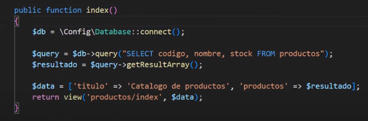

Usando un modelo, ya no es necesario realizar la conexión de la misma manera ya que el framework la hace a través de métodos que se utilizan al usar un modelo

el primer paso es instanciar el modelo desde cualquier función del controlador

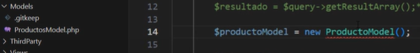

no olvides importar la carpeta contenedora del modelo junto con el modelo para no importar todo

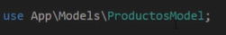

# Constructor del controlador- instancia al modelo

Se recomienda instanciar al modelo desde el constructor de el controller

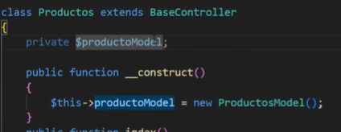

para poder invocar los métodos o funciones de un modelo desde cualquier función de la clase o controlador

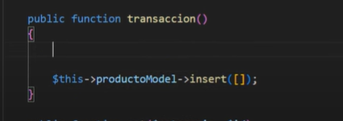

# Función findAll();

### ¿Qué es findAll()?

La función findAll() es parte de la clase Model en CodeIgniter 4 y se utiliza para recuperar todos los registros de una tabla, o un subconjunto de registros especificando un límite y un offset.

después de instanciar el modelo existe la función findAll();
Esta función contiene un select \ sin ningún where

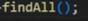 => 

si la información que nos retorna es de tipo array hay que meter ese arreglo en una variable

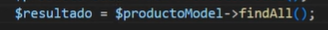

Aquí se puede ver como se configuro para recibir un arreglo desde el modelo

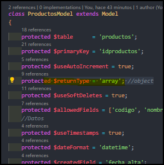

para obtener la informacion en la vista hay que iterar con un foreach

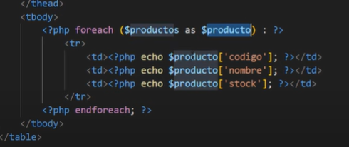

Otro ejemplo

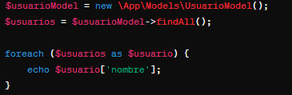

Con limite y offset


Notas Adicionales

- **Seguridad**: Asegúrate de usar funciones de escape como esc() en las vistas para evitar ataques XSS.
- **Optimización**: Si esperas muchos registros, considera usar paginación para mejorar el rendimiento.

# Función find()

### ¿Qué hace la función find()?

La función find() busca un registro en la base de datos basado en su clave primaria. Es decir, debes pasar el valor de la clave primaria del registro que deseas recuperar como argumento de la función

Ejemplo

Modelo


Funcion llamada desde el controlador


Sirve para traer un solo registro pide como parámetro un id y devuelve el id del registro consultado


en la vista lo estarias imprimiendo de esta manera


Tambien se puede pedir un arreglo de valores por ejemplo


de esta manera se tiene que actualizar la forma en la que se va a imprimir


# FUNCIÓN insert() Y getInsertId()

Sirve para insertar valores en una tabla es un metodo propio del modelo
y si lo imprimes con un echo te retorna un 1 como valor booleano el cual representa que el insert se realizo correctamente


se le manda como parametro un arreglo con los valores que se desaen insertar en la tabla es necesario que estos cumplan con el tipo de vaslores que requiere la tabla en cada registro


ademas de el arreglo con los valores puedes ponerle false o true para poder obtener tambien el id de lo que insertaste en la tabla.
Por ejemplo


Resultado en pantalla por el echo


## Lamar al ultimo ID insertado

Otra forma de obtener el ultimo ID insertado es con la funcion getInsertId()


# FUNCION Update()

En CodeIgniter 4, la función update es fundamental para modificar registros en la base de datos.


Notas Importantes
Protección de Campos:
Asegúrate de que los campos que estás actualizando están en la propiedad allowedFields del modelo. Esto ayuda a prevenir ataques de inyección SQL.

Retorno de la Función:
La función update retorna true en caso de éxito y false en caso de error.

Lo primero es crear un arreglo con la información que vas a cambiar


Después declaras tu Funcion y como parámetro le mandas el arreglo y el id del registro que vas a modificar


Tambien se pueden cambiar varios registros a la vez con un arreglo en la parte donde va el id

ejemplo


# FUNCION Delete()

Para eliminar un registro de una base de datos es necesario ser consiente de que existe una opción en el modelo que te permite controlar si al borrar un registro se borra definitivamente o solo se deja de cargar.
Esta configuración es


si se tiene como True no elimina el registro
si se tiene como False si elimina el registro

la función solo requiere que se le pase el id del registro que queremos eliminar

De esta manerta si tu tienes un campo llamado fecha_elimina en tu tabla el registro no se eliminará sino que esa fecha de eliminacion se actualizara


Si useSoftDeletes lo cambiamos a false el registro sera eliminado


de esta manera si se borra el registro


de igual manera esto puede funcionar con un arreglo con diferentes ids


al final de cuentas si tu realizas una consulta con findAll()
Solo obtendras los registros que no tengan fecha de eliminacion, y los registros existentes


Para obtener todos los registros estén con fecha de eliminación o no debes de usar una función extra


De esta manera se traen todos los registros aunque tengan fecha de eliminación

# FUNCION purgeDeleted()

Esta función sirve para eliminar definitivamente los registros que se hayas dado de baja.


Ejemplo;

Antes


Después de llamar a la función


Pero es necesario tener activa la opción de useSoftDeletes


# Query Builder Class en CodeIgniter 4

En CodeIgniter 4, la **Query Builder Class** es una herramienta poderosa que facilita la construcción y ejecución de consultas SQL de manera programática y segura. Esta clase te permite interactuar con la base de datos sin necesidad de escribir directamente las consultas SQL, lo cual reduce errores y mejora la seguridad contra inyecciones SQL. Aquí te dejo un resumen de sus características principales:

### Características de la Query Builder Class

1. **Construcción de Consultas**: Permite construir consultas `SELECT`, `INSERT`, `UPDATE` y `DELETE` de forma sencilla y legible.
2. **Encadenamiento de Métodos**: Los métodos se pueden encadenar para crear consultas más complejas de manera clara y estructurada.
3. **Escapado Automático**: Los valores y nombres de tablas y columnas se escapan automáticamente para prevenir inyecciones SQL.
4. **Compatibilidad con Distintas Bases de Datos**: CodeIgniter 4 soporta múltiples tipos de bases de datos, y la Query Builder Class maneja las diferencias entre ellas.

### Ejemplos Prácticos

### SELECT

```php
// Conecta con la base de datos utilizando la configuración por defecto
$db = \Config\Database::connect();

// Obtiene el constructor de consultas para la tabla 'users'
$builder = $db->table('users');

// Construye una consulta SELECT para obtener los campos 'id', 'name' y 'email' de la tabla 'users'
// Añade una condición WHERE para seleccionar solo los registros donde el 'status' sea 'active'
// Ordena los resultados por el campo 'name' en orden ascendente
$query = $builder->select('id, name, email')
                 ->where('status', 'active')
                 ->orderBy('name', 'ASC')
                 ->get();

// Ejecuta la consulta y obtiene los resultados como un array de objetos
$results = $query->getResult();
```

### INSERT

```php
$data = [
    'name' => 'John Doe',
    'email' => 'john.doe@example.com',
    'status' => 'active'
];

$builder->insert($data);
```

### UPDATE

```php
$data = [
    'status' => 'inactive'
];

$builder->where('id', 1)
        ->update($data);
```

### DELETE

```php
$builder->where('id', 1)
        ->delete();
```

### Ventajas

- **Simplicidad y Legibilidad**: Hace que las consultas sean más fáciles de leer y escribir.
- **Seguridad**: Reduce riesgos de inyección SQL.
- **Flexibilidad**: Facilita la creación de consultas complejas mediante el encadenamiento de métodos.

La Query Builder Class en CodeIgniter 4 es esencial para trabajar con bases de datos de manera eficiente y segura, permitiendo a los desarrolladores centrarse más en la lógica de negocio y menos en los detalles técnicos de SQL.

### Funcion where de la clase query builder

El método where se utiliza para añadir una cláusula WHERE a una consulta SQL, filtrando los registros que cumplen con una condición específica.


En resumen, el método where en la clase Query Builder de CodeIgniter 4 es fundamental para filtrar los resultados de las consultas SQL según condiciones específicas.

otra forma


#### Ver ultima query


Tambien puede ser con


Sin embargo un objeto se tiene que tratar de diferente manera para poder ser impreso

Recuerda la diferencia entre

getResult(); y getResultArray();

Es la forma en la que te retorna la información

con getResultArray(); Obtenemos


### Función select de la clase query builder

La función select se utiliza para definir las columnas que quieres recuperar de una tabla en una consulta SELECT.


Ejemplo practico

```php
// Conecta con la base de datos utilizando la configuración por defecto
$db = \Config\Database::connect();

// Obtiene el constructor de consultas para la tabla 'users'
$builder = $db->table('users');

// Construye una consulta SELECT para obtener los campos 'id', 'name' y 'email' de la tabla 'users'
// Añade una condición WHERE para seleccionar solo los registros donde el 'status' sea 'active'
// Ordena los resultados por el campo 'name' en orden ascendente
$query = $builder->select('id, name, email') // Define las columnas a seleccionar
                 ->where('status', 'active') // Agrega la condición WHERE
                 ->orderBy('name', 'ASC') // Ordena los resultados
                 ->get(); // Ejecuta la consulta

// Ejecuta la consulta y obtiene los resultados como un array de objetos
$results = $query->getResult();
```

Segundo ejemplo

Consulta


Resultado


Ejemplo con 2 where y un select


la query sería así


se puede hacer tambien de esta manera
para dos filtros con un solo where se agrega un arreglo y se envia a un solo where


El resultado seria el mismo


también es verdad que se pueden agregar directamente operaciones lógicas desde el una variable string


El resultado seria el mismo


### Funcion orderBy() de la clase Query Builder

La función orderBy en el Query Builder de CodeIgniter 4 se utiliza para especificar el orden en el que se deben devolver los resultados de una consulta SQL. Puedes ordenar los resultados en orden ascendente (ASC) o descendente (DESC) según una o más columnas.


Ejemplo practico

```php
// Conecta con la base de datos utilizando la configuración por defecto
$db = \Config\Database::connect();

// Obtiene el constructor de consultas para la tabla 'users'
$builder = $db->table('users');

// Construye una consulta SELECT para obtener los campos 'id', 'name' y 'email' de la tabla 'users'
// Añade una condición WHERE para seleccionar solo los registros donde el 'status' sea 'active'
// Ordena los resultados por el campo 'name' en orden ascendente
$query = $builder->select('id, name, email') // Define las columnas a seleccionar
                 ->where('status', 'active') // Agrega la condición WHERE
                 ->orderBy('name', 'ASC') // Ordena los resultados por el campo 'name' en orden ascendente
                 ->get(); // Ejecuta la consulta

// Ejecuta la consulta y obtiene los resultados como un array de objetos
$results = $query->getResult();
```

La función orderBy es una herramienta esencial en el Query Builder de CodeIgniter 4 para controlar la secuencia en la que se presentan los resultados de una consulta, permitiendo ordenar de forma sencilla y eficiente.

### Función limit(); de Query Builder

se utiliza para restringir el número de filas devueltas por una consulta SQL. Es útil cuando necesitas paginar resultados o simplemente obtener un subconjunto específico de los datos.


Ejemplo práctico

```php
// Conecta con la base de datos utilizando la configuración por defecto
$db = \Config\Database::connect();

// Obtiene el constructor de consultas para la tabla 'users'
$builder = $db->table('users');

// Construye una consulta SELECT para obtener los campos 'id', 'name' y 'email' de la tabla 'users'
// Añade una condición WHERE para seleccionar solo los registros donde el 'status' sea 'active'
// Ordena los resultados por el campo 'name' en orden ascendente
// Limita los resultados a un máximo de 10 filas
$query = $builder->select('id, name, email') // Define las columnas a seleccionar
                 ->where('status', 'active') // Agrega la condición WHERE
                 ->orderBy('name', 'ASC') // Ordena los resultados por el campo 'name' en orden ascendente
                 ->limit(10) // Limita los resultados a 10 filas
                 ->get(); // Ejecuta la consulta

// Ejecuta la consulta y obtiene los resultados como un array de objetos
$results = $query->getResult();
```

La función limit es una herramienta esencial en el Query Builder de CodeIgniter 4 para gestionar la cantidad de datos recuperados por una consulta, proporcionando control y eficiencia en el manejo de resultados.

Ejemplo 2


## Query Builder y sus demas funciones

la Clase Query Builder contiene aun m,as funciones que se pueden consultar en la documentación oficial de CodeIgniter 4

aqui te mostare un resumen rapido de algunas que ya vimos y otras que uan faltan


```php
$count = $builder->where('status', 'active')->countAllResults();
```


```php
$builder->set('name', 'John Doe')->set('status', 'active')->insert();
```

## Join conQuery Builder

Puede que requieras hacer un join de dos tablas y que en ambas tablas existan columnas llamadas con el mismo nombre;
lo que provocará posibles confusiones a la hora de interpretarse tu codigo. y por ejemplo si las dos tablas tiene una columna llamada nombre tienes que hacer uso de AS para asignar otro nombre
Por ejemplo

```php
$db = \Config\Database::connect();
        $builder = $db->table('productos');
        $builder->select('*');
        $builder->join('almacen', 'productos.id_almacen=almacen.idalmacen');
        $query = $builder->get();
        $resultado = $query->getResultArray();
        echo $db->getLastQuery();
```


con este select estamos trayendo toso los campos sin importar su nombre lo cual es malo
lo ideal es que hagas realices AS cuando los nombres de las columnas se repiten de esta manera


de esta manera estamos especificando que queremos cambiar el nombre de una columna llamada nombre ya que se repite la misma columna en la otra tabla.
Esto permite evitar confusiones a la hora de usar la respuesta de la query

# Migrations o Migraciones

## Que son las migraciones


Se guardan dentro de

app/Database/Migrations

Se pueden generar de manera automática con spark y de manera manual

De manera automática


Como podemos observar en el nombre llevan un formato de fecha y hora el cual se debe respetar ya que el framework indexa estos archivos según sus fechas,

El formato para dichas fechas es ;


Con esto el framework sabra en que orden ejecutar las migraciones

Estructura inicial


La función up sirve para crear la estructura o hacer las modificaciones y que se ejecuten en tu base de datos

La función down sirve para revertir o hacer un rollback de las modificaciones que se hagan en up

Ejemplo

```php
<?php
// Declaración del namespace para la migración
namespace App\Database\Migrations;
// Importa la clase Migration de CodeIgniter
use CodeIgniter\Database\Migration;

// Definición de la clase CreaTablaCategorias que extiende de Migration
class CreaTablaCategorias extends Migration
{
    // Método up para crear la tabla 'categorias'
    public function up()
    {
        // Define los campos de la tabla 'categorias'
        $this->forge->addField([
            // Campo 'id', entero, con auto incremento
            'id' => [
                'type' => 'INT', // Tipo de dato entero
                'constraint' => 11, // Longitud del campo
                'auto_increment' => true, // Auto incremento
            ],
            // Campo 'nombre', tipo varchar, longitud 100
            'nombre' => [
                'type' => 'VARCHAR', // Tipo de dato cadena de texto
                'constraint' => 100, // Longitud máxima de 100 caracteres
            ]
        ]);

        // Define la clave primaria de la tabla
        $this->forge->addKey('id', true); // 'id' como clave primaria

        // Crea la tabla 'categorias' con los campos definidos
        $this->forge->createTable('categorias');
    }

    // Método down para eliminar la tabla 'categorias'
    public function down()
    {
        // Elimina la tabla 'categorias' si existe
        $this->forge->dropTable('categorias');
    }
}
?>
```

## Cómo ejecutar una Migración

Es posible ejecutar una Migracion desde un controlador con uso de una variable y un Try Catch

Ejemplo

```php
<?php

// Declaración del namespace para el controlador
namespace App\Controllers;

// Definición de la clase Home que extiende de BaseController
class Home extends BaseController
{
    // Método index que será el punto de entrada cuando se accede al controlador
    public function index()
    {
        // Carga el servicio de migraciones de CodeIgniter
        $migrate = \Config\Services::migrations();

        try {
            // Intenta ejecutar las migraciones hasta la versión más reciente
            $migrate->latest();
        } catch (\Throwable $e) {
            // Si ocurre una excepción, la captura y la muestra
            echo $e;
        }
    }
}
?>
```

En este ejemplo se llama al servicio de migraciones y se ejecuta el método `latest()` que ejecuta la última migración disponible.

## Migracion para crear una tabla y borrarla

```php
<?php
namespace App\Database\Migrations; // Define el espacio de nombres para la migración

use CodeIgniter\Database\Migration; // Importa la clase Migration de CodeIgniter

class CreaTablaCategorias extends Migration // Define una nueva clase que extiende la clase Migration
{
    public function up() // Método que se ejecuta al aplicar la migración
    {
        $this->forge->addField([ // Añade campos a la tabla utilizando el objeto forge
            'id' => [ // Define un campo 'id'
                'type' => 'INT', // El tipo de dato es entero
                'constraint' => 11, // El tamaño del campo es 11
                'auto_increment' => true, // El campo es auto-incremental
                'unsigned' => true, // El campo no permite valores negativos
            ],
            'nombre' => [ // Define un campo 'nombre'
                'type' => 'VARCHAR', // El tipo de dato es cadena de texto
                'constraint' => 100, // El tamaño máximo es 100 caracteres
            ],
        ]);
        $this->forge->addKey('id', true); // Establece 'id' como clave primaria
        $this->forge->createTable('categorias'); // Crea la tabla 'categorias'
    }

    public function down() // Método que se ejecuta al revertir la migración
    {
        $this->forge->dropTable('categorias'); // Elimina la tabla 'categorias'
    }
}

```

## Migración para Modificar la Tabla (Agregar una Columna y eliminar)

Esta migración añade una nueva columna descripcion a la tabla categorias.

```php
<?php
namespace App\Database\Migrations; // Define el espacio de nombres para la migración

use CodeIgniter\Database\Migration; // Importa la clase Migration de CodeIgniter

class AgregaDescripcionACategorias extends Migration // Define una nueva clase que extiende la clase Migration
{
    public function up() // Método que se ejecuta al aplicar la migración
    {
        $fields = [ // Define un array de campos para añadir a la tabla
            'descripcion' => [ // Define un campo 'descripcion'
                'type' => 'TEXT', // El tipo de dato es texto
                'null' => true, // Permite valores nulos
            ],
        ];
        $this->forge->addColumn('categorias', $fields); // Añade el campo 'descripcion' a la tabla 'categorias'
    }

    public function down() // Método que se ejecuta al revertir la migración
    {
        $this->forge->dropColumn('categorias', 'descripcion'); // Elimina el campo 'descripcion' de la tabla 'categorias'
    }
}
```

## Regresar a otra migración

Cuando utilizas migraciones


En tu base de datos se te genera una tabla llamada migrations
para regresar a migraciones anteriores puedes utilizar en un controlador el comando


esto te regresará a una migración anterior

## Ejecutar una migracion desde consola


con este comando ejecutas todas tus migraciones hasta la ultima o la mas reciente

Tambien es posible elegir a que migracion quieres egresar tu base de datos

esto con ayuda de la tabla migratios que se genera sola cuando utilizas una migraciones


con la columna batch
y el comando


siendo el 1 el numero de batch

si quieres regresar todas las migraciones puedes omitir poner -b (numerode batchs es decir)


# Seeders

Se utilizan para agregar grandes cantidades de información

los seeders son herramientas poderosas para poblar tu base de datos con datos de prueba. Estos scripts te permiten insertar rápidamente datos iniciales en tus tablas de base de datos, lo que es útil durante el desarrollo y las pruebas.

Los seeders en CodeIgniter 4 siguen el principio de "sembrar" datos, donde creas archivos PHP dedicados que contienen métodos para insertar datos en tus tablas. Puedes crear múltiples archivos de seeder para diferentes tablas o incluso para diferentes tipos de datos.

Una vez que hayas escrito tus seeders, puedes ejecutarlos usando la CLI de CodeIgniter para insertar los datos en tu base de datos. Esto facilita la creación y la gestión de datos de prueba, lo que a su vez acelera el proceso de desarrollo y pruebas de tu aplicación.

## Donde estan los seeders

La carpeta contenedora de seeders por defecto en codeigniter es

app/Database/Seeds

## crear seeders desde CLI

Con ayuda de SPARK podemos ingresar el comando

```go
php spark make:seeder NombreDelSeeder
```

## Estructura de un seeder

```php
<?php

namespace App\Database\Seeds; // Define el namespace para la clase CategoriasSeeder en el directorio App\Database\Seeds.

use CodeIgniter\Database\Seeder; // Importa la clase Seeder del namespace CodeIgniter\Database.

class CategoriasSeeder extends Seeder // Declara la clase CategoriasSeeder que extiende de Seeder.
{
    public function run() // Define el método run que se ejecutará al correr el seeder.
    {
        $dta = [ // Define un array asociativo con los datos de la categoría a insertar en la base de datos.
            'nombre' => 'bebidas', // Asigna el valor 'bebidas' a la clave 'nombre'.
        ];
        $this->db->table('categorias')->insertBatch($dta); // Inserta los datos de la categoría en la tabla 'categorias' de la base de datos.
    }
}
```

## Ejecutar seeder con CLI y desde un controller

Desde un controlador se instancia y se llama al metodo call


Desde CLI


# Helpers

En CodeIgniter 4, los "helpers" son funciones globales que pueden ser utilizadas en todo el sistema sin necesidad de cargar una instancia de clase específica. Estas funciones son útiles para realizar tareas comunes de forma rápida y sencilla en tus aplicaciones. Los helpers están diseñados para proporcionar funcionalidades básicas que son necesarias en muchos proyectos web.

Algunos ejemplos de helpers en CodeIgniter 4 incluyen funciones para trabajar con arrays, strings, URLs, formularios, archivos, fechas, y más. Por ejemplo, puedes encontrar helpers como url_helper para generar URLs de forma dinámica, form_helper para crear y validar formularios, file_helper para trabajar con archivos, entre otros.

Puedes cargar un helper específico en tu controlador, modelo o vista utilizando el método helper() de la clase CodeIgniter\Functions\Functions. Por ejemplo:

```php
helper('url'); // Carga el helper url_helper

// Ahora puedes usar las funciones del helper en cualquier parte del código
echo base_url('controlador/metodo');
```

## ubicacion

Los Helpers por defecto se encuentran en

app/system/Helpers

En esta capreta ya se encuentran los helpers predefinidos pero puedes agregar mas


1. **array_helper**: Contiene funciones para trabajar con arrays, como `element()`, `random_element()`, `array_dot()` y más.

2. **cookie_helper**: Proporciona funciones para trabajar con cookies en tus aplicaciones web.

3. **date_helper**: Contiene funciones para formatear y trabajar con fechas y horas.

4. **file_helper**: Ofrece funciones para trabajar con archivos, como leer, escribir, eliminar, y manipular rutas de archivos.

5. **form_helper**: Proporciona funciones para generar y validar formularios HTML de manera sencilla.

6. **html_helper**: Contiene funciones para generar elementos HTML comunes, como enlaces, listas, tablas, entre otros.

7. **inflector_helper**: Ofrece funciones para pluralizar y singularizar strings.

8. **kint_helper**: Proporciona funciones para debugging avanzado utilizando la biblioteca Kint.

9. **number_helper**: Ofrece funciones para formatear números y realizar operaciones matemáticas básicas.

10. **security_helper**: Proporciona funciones para realizar tareas de seguridad, como escapar datos y limpiar inputs.

11. **test_helper**: Contiene funciones útiles para escribir y ejecutar pruebas unitarias.

12. **text_helper**: Ofrece funciones para trabajar con strings, como `word_limiter()`, `character_limiter()`, `highlight_code`, y más.

13. **url_helper**: Contiene funciones para generar y manipular URLs de forma sencilla.

14. **xml_helper**: Proporciona funciones para trabajar con datos XML.

Si quieres agregar un helper propio puedes agregarlo en

app/Helpers

## Como Activar un helper

Si quieres que se puedan utilizar en todos tus controladores puedes activarlo desde el BaseController

En la sección


DE ESTA MANERA SE ACTIVAN


si quieres activar un helper para un solo controlador puedes llamarlo desde el constructor del controlador de esta manera


Esto lo habilitara para poder utilizarlo en cualquier funcion del controlador

Otra manera mas ligera de usarlo es cargarlo solamente en las funciones que lo vas a usar del controlador


ESTO PERMIE NO SEBRECARGAR TODO TU CONTROLADOR DE FUNCIONES DEL HELPER

## Creacion de Helper

Tenemos que ir a la ubicacion por defecto de los helpers segun la version de codel esta puede variar

aqui creamos un archivo tipo .php y le metemos la estructura basica

```php
<?php

if (!function_exists('generaToken')) {
    function generaToken()
    {
        return md5(uniqid(mt_rand(), true));
    }
}
```

# Creacion de formularios

En codeIgniter 4 existe un helper que te proporciona funciones para la creracion de formularios 'form' y tambien se pueden crear con etiquetas html

basta con llamar al helper form desde el controlador


Desde el constructor


O desde el BaseController


y retornar una vista que lo implemente


este es un ejemplo de un formulario pequeño que utiliza funciones el helper 'form'

```php
<!DOCTYPE html>
<html lang="en">

<head>
    <meta charset="UTF-8">
    <meta name="viewport" content="width=device-width, initial-scale=1.0">
    <title>Document</title>
</head>

<body>
    <h1>Nuevo Producto</h1>

    <?php echo form_open('producto/guarda'); ?>
    <?php
    $atributos = [
        'type' => 'text',
        'id' => 'codigo',
        'name' => 'codigo',
        'class' => 'form-control',
        'required' => false,
    ]
    ?>

    <p>
        <?php echo form_label('Código', 'codigo'); ?>
        <?php echo form_input($atributos); ?>

    </p>
    <p>
        <?php echo form_label('Nombre', 'nombre'); ?>
        <?php echo form_input('nombre', '', ['id' => 'nombre']); ?>
    </p>
    <p>
        <?php echo form_label('Precio', 'precio'); ?>
        <?php echo form_input('precio', '0.00', ['id' => 'precio']); ?>
    </p>
    <p>
        <?php echo form_label('Stock', 'stock'); ?>
        <?php echo form_input('stock', '0', ['id' => 'stock']); ?>
    </p>

    <p>
        <?php echo form_submit('submit', 'Guardar'); ?>
    </p>

    <?php echo form_close() ?>
</body>

</html>
```

Otra forma de crear formularios es con las etiquetas html

```php
<?php echo $this->extend('plantilla/layout'); ?>

<?php echo $this->section('contenido'); ?>

<!-- Contenido -->
<main class="page">
   <div class="container">
       <br>
       <br>
       <h1>Nuevo Producto</h1>
       <form action=<?php echo base_url('/producto/guarda') ?> method="post">
           <div class="form-group">
               <label for="codigo" class="form-label">Código</label>
               <input type="text" id="codigo" name="codigo" class="form-control" required>
           </div>
           <div class="form-group">
               <label for="nombre">Nombre</label>
               <input type="text" id="nombre" name="nombre" class="form-control" required>
           </div>
           <div class="form-group">
               <label for="precio">Precio</label>
               <input type="number" id="precio" name="precio" class="form-control" min="1" step="0.01" value="0.00" required>
           </div>
           <div class="form-group">
               <label for="stock">Stock</label>
               <input type="number" id="stock" name="stock" class="form-control" min="0" value="0" required>
           </div>
           <button type="submit" class="btn btn-primary">Guardar</button>
       </form>
   </div>
</main>
<?php echo $this->endSection('contenido'); ?>
```

# Validaciones con Helper validations

Tienes que recibir desde un controlador el formulario que recibes

Formulario con action a una ruta


ruta


Funcion para validar; contiene un arreglo con las condiciones que requiere tener cada campo o input
Todos son referenciados con su name

el arreglo puede ser llenado con diferentes validaciones, puedes encontrar todas las validaciones en la documentacion oficial de codeIgniter 4

este arreglo se valida con la funcion validate del helper


en este caso agregue estas validaciones


Si en el campo codigo escribimos algo que ya exista en nuestra tabla en la columna de codigo nos mandara un error

esto imprimiendo desde la vista la funcion


Aqui como ya existe un registro de codigo me manda un mensaje de validacion en ingles


Para modificar los mensajes de validacion
podemos modificarlos desde


y la otra opcion es modificarlo desde tu arreglo de reglas


al final el mensaje de error se muestra de esta manera


## Evita que se reiniciew el formulario despues de validar

el helper form cuenta con una funcion para que el formulario no se reinicie despues de haber tenido un error de validacion

se le tiene que agregar a cada input


## Error alado del input

Para colocar elmensaje de error de validacion abajo del input correspondiente hay otra funcion disponible

por ejemplo


# Validaciones personalizadas

# Uso de CLI SPARK

Montar server


Generacion de Archivos

- controller


- modelo


puedes crear todo junto


# Metodos HTTP y RESTfull


